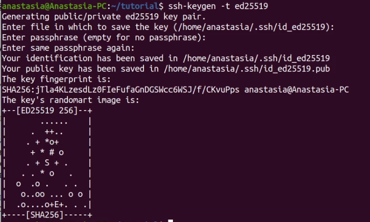

---
## Front matter
lang: ru-RU
title: Лабораторная работа No 2.
author: |
	Анастасия Павловна Баранова, НБИбд-01-21\inst{1}
institute: |
	\inst{1}Российский Университет Дружбы Народов

date: 27 апреля, Москва, 2022 г.

## Formatting
toc: false
slide_level: 2
theme: metropolis
header-includes: 
 - \metroset{progressbar=frametitle,sectionpage=progressbar,numbering=fraction}
 - '\makeatletter'
 - '\beamer@ignorenonframefalse'
 - '\makeatother'
aspectratio: 43
section-titles: true
---

# Управление версиями

## Цель работы

Целью данной работы является изучение идеологии и применения средств контроля версий и освоение умений работать с git.

# Выполнение лабораторной работы

## Настройка github

Создаю учетную запись на github и заполняю основные данные.

## Установка программного обеспечения

Устанавливаю git-flow.

Устанавливаю gh.

## Базовая настройка git

Задаю имя и email владельца репозитория.

Настрою utf-8 в выводе сообщений git.

Настрою верификацию и подписание коммитов git. Зададам имя начальной ветки (будем называть её master), параметр autocrlf, параметр safecrlf.

## Создание ключей ssh

Создам ключ ssh по алгоритму rsa с ключём размером 4096 бит.

Создам ключ ssh по алгоритму ed25519.

## Создание ключей gpg

Генерирую ключ gpg.

## Добавление GPG ключа в GitHub

Добавляю GPG ключ в GitHub. Вывожу список ключей и копирую отпечаток приватного ключа.

Перехожу в настройки GitHub (https://github.com/settings/keys), нажимаю на кнопку New GPG key и вставляю полученный ключ в поле ввода.

## Настройка автоматических подписей коммитов git

Настрою автоматические подписи коммитов git. Используя введёный email, укажу Git применять его при подписи коммитов.

## Настройка gh

Настрою gh. Авторизуюсь.

## Шаблон для рабочего пространства

Создам репозиторий курса на основе шаблона.

Настрою каталог курса.

## Вывод

В ходе выполнения данной лабораторной работы я изучила идеологию и применение средств контроля версий и освоила умения по работе с git.

## {.standout}

