---
## Front matter
lang: ru-RU
title: Лабораторная работа No 4.
author: |
	Анастасия Павловна Баранова, НБИбд-01-21\inst{1}
institute: |
	\inst{1}Российский Университет Дружбы Народов
date: 29 апреля, Москва, 2022 г.

## Formatting
toc: false
slide_level: 2
theme: metropolis
header-includes: 
 - \metroset{progressbar=frametitle,sectionpage=progressbar,numbering=fraction}
 - '\makeatletter'
 - '\beamer@ignorenonframefalse'
 - '\makeatother'
aspectratio: 43
section-titles: true
---

# Основы интерфейса взаимодействия пользователя с системой Unix на уровне командной строки

## Цель работы

Целью данной работы является приобретение практических навыков взаимодействия пользователя с системой посредством командной строки.

# Выполнение лабораторной работы

## Определение полного имени домашнего каталога.

Определяю полное имя моего домашнего каталога. Далее относительно этого каталога будут выполняться последующие упражнения.

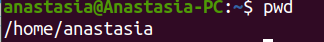

## Переход в каталог /tmp.

Перейду в каталог /tmp.

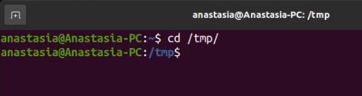

## Вывод на экран содержимого каталога /tmp.

Выведу на экран содержимое каталога /tmp. Для этого использую команду ls с различными опциями. С помощью команды ls -a выведу на экран содержимое каталога включая скрытые файлы.

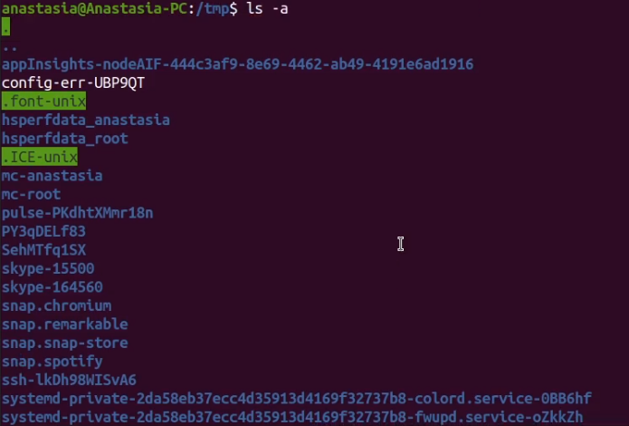

## Вывод подробной информации о файлах и каталогах.

С помощью команды ls -l выведу на экран подробную информацию о файлах и каталогах.

## Вывод содержимого и подробной информации о файлах и каталогах.

С помощью команды ls -alF выведу на экран содержимое каталога включая скрытые файлы, подробную информацию о файлах и каталогах, информацию о типах файлов.

## Проверка.

Определю, есть ли в каталоге /var/spool подкаталог с именем cron. Подкаталог с именем cron существует.

## Вывод на экран содержимого домашнего каталога.

Перейду в мой домашний каталог и выведу на экран его содержимое. Определю, кто является владельцем файлов и подкаталогов. Владельцем почти всех файлов и каталогов является мой пользователь anastasia, кроме одного каталога, владельцем которого является root (суперпользователь).

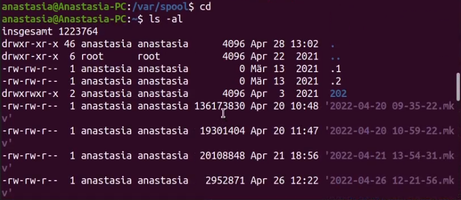

## Создание каталога newdir.

В домашнем каталоге создам новый каталог с именем newdir.

## Создание каталога morefun.

В каталоге ~/newdir создам новый каталог с именем morefun.

## Создание трёх каталогов одной командой.

В домашнем каталоге создам одной командой три новых каталога с именами letters, memos, misk. Затем удалю эти каталоги одной командой.

## Удаление трёх каталогов одной командой.

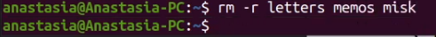

## Попытка удалить каталог ~/newdir.

Попробую удалить ранее созданный каталог ~/newdir командой rm. Проверю, был ли каталог удалён. Удаление каталога ~/newdir командой rm невозможно.

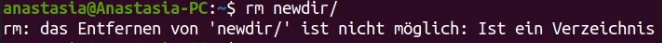

## Успешное удаление каталога ~/newdir.

Удалю каталог ~/newdir/morefun из домашнего каталога с помощью команды rm -r. Проверю, был ли каталог удалён.

## Выполнение команды man.

С помощью команды man определю, какую опцию команды ls нужно использовать для просмотра содержимого не только указанного каталога, но и подкаталогов, входящих в него. Это опция -R.

## Опция команды ls для просмотра содержимого.

## Выполнение команды man.

С помощью команды man определю набор опций команды ls, позволяющий отсортировать по времени последнего изменения выводимый список содержимого каталога с развёрнутым описанием файлов. Эти опции -l и -t.

## Опция -l.

## Опция -t.

## Невозможно узнать подробнее об опциях команды cd.

Использую команду man для просмотра описания следующих команд: cd, pwd, mkdir, rmdir, rm. Поясню основные опции этих команд.

## Выполнение команды man.

## Основные опции команды pwd.

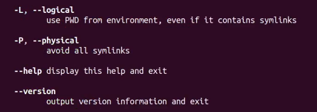

## Выполнение команды man.

## Основные опции команды mkdir.

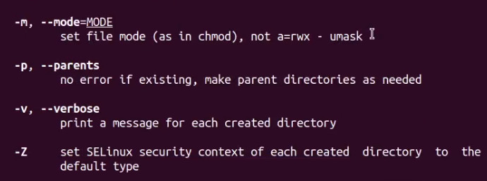

## Выполнение команды man.

## Основные опции команды rmdir.

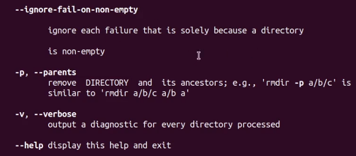

## Выполнение команды man.

## Основные опции команды rm.

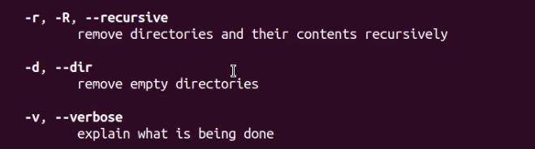

## Выполнение команды history.

Используя информацию, полученную при помощи команды history, выполню модификацию и исполнение нескольких команд из буфера команд.

## Модификация команды ls -al.

Модификация команды ls -al.

## Модификация команды ls -a.

Модификация команды ls -a.

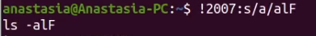

## Вывод

В ходе выполнения данной лабораторной работы я приобрела практические навыки взаимодействия пользователя с системой по-
средством командной строки.