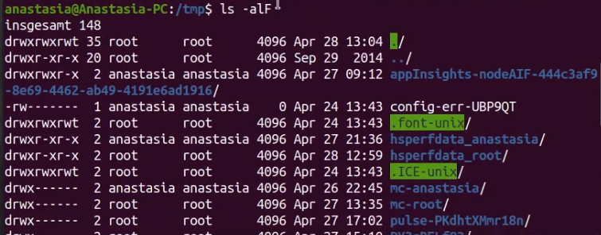
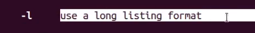

---
## Front matter
title: "ОТЧЕТ ПО ЛАБОРАТОРНОЙ РАБОТЕ №4"
subtitle: "Основы интерфейса взаимодействия пользователя с системой Unix на уровне командной строки"
author: "Анастасия Павловна Баранова, НБИбд-01-21"

## Generic otions
lang: ru-RU
toc-title: "Содержание"

## Bibliography
bibliography: bib/cite.bib
csl: pandoc/csl/gost-r-7-0-5-2008-numeric.csl

## Pdf output format
toc: true # Table of contents
toc-depth: 2
lof: true # List of figures
#lot: true # List of tables
fontsize: 12pt
linestretch: 1.5
papersize: a4
documentclass: scrreprt
## I18n polyglossia
polyglossia-lang:
  name: russian
  options:
	- spelling=modern
	- babelshorthands=true
polyglossia-otherlangs:
  name: english
## I18n babel
babel-lang: russian
babel-otherlangs: english
## Fonts
mainfont: PT Serif
romanfont: PT Serif
sansfont: PT Sans
monofont: PT Mono
mainfontoptions: Ligatures=TeX
romanfontoptions: Ligatures=TeX
sansfontoptions: Ligatures=TeX,Scale=MatchLowercase
monofontoptions: Scale=MatchLowercase,Scale=0.9
## Biblatex
biblatex: true
biblio-style: "gost-numeric"
biblatexoptions:
  - parentracker=true
  - backend=biber
  - hyperref=auto
  - language=auto
  - autolang=other*
  - citestyle=gost-numeric
## Pandoc-crossref LaTeX customization
figureTitle: "Рис."
tableTitle: "Таблица"
listingTitle: "Листинг"
lofTitle: "Список иллюстраций"
lotTitle: "Список таблиц"
lolTitle: "Листинги"
## Misc options
indent: true
header-includes:
  - \usepackage{indentfirst}
  - \usepackage{float} # keep figures where there are in the text
  - \floatplacement{figure}{H} # keep figures where there are in the text
---

# Цель работы

Целью данной работы является приобретение практических навыков взаимодействия пользователя с системой посредством командной строки.

# Задание

1. Определите полное имя вашего домашнего каталога. Далее относительно этого каталога будут выполняться последующие упражнения.
2. Выполните следующие действия:
   1. Перейдите в каталог /tmp.
   2. Выведите на экран содержимое каталога /tmp. Для этого используйте команду ls с различными опциями. Поясните разницу в выводимой на экран информации.
   3. Определите, есть ли в каталоге /var/spool подкаталог с именем cron?
   4. Перейдите в Ваш домашний каталог и выведите на экран его содержимое. Определите, кто является владельцем файлов и подкаталогов?
3. Выполните следующие действия:
   1. В домашнем каталоге создайте новый каталог с именем newdir.
   2. В каталоге ~/newdir создайте новый каталог с именем morefun.
   3. В домашнем каталоге создайте одной командой три новых каталога с именами letters, memos, misk. Затем удалите эти каталоги одной командой.
   4. Попробуйте удалить ранее созданный каталог ~/newdir командой rm. Проверьте, был ли каталог удалён.
   5. Удалите каталог ~/newdir/morefun из домашнего каталога. Проверьте, был ли каталог удалён.
4. С помощью команды man определите, какую опцию команды ls нужно использовать для просмотра содержимое не только указанного каталога, но и подкаталогов, входящих в него.
5. С помощью команды man определите набор опций команды ls, позволяющий отсортировать по времени последнего изменения выводимый список содержимого каталога с развёрнутым описанием файлов.
6. Используйте команду man для просмотра описания следующих команд: cd, pwd, mkdir, rmdir, rm. Поясните основные опции этих команд.
7. Используя информацию, полученную при помощи команды history, выполните модификацию и исполнение нескольких команд из буфера команд.

# Выполнение лабораторной работы

Определяю полное имя моего домашнего каталога. Далее относительно этого каталога будут выполняться последующие упражнения. (рис. [-@fig:001])

{ #fig:001 width=70% }

Перейду в каталог /tmp (рис. [-@fig:002]).

{ #fig:002 width=70% }

Выведу на экран содержимое каталога /tmp. Для этого использую команду ls с различными опциями. С помощью команды ls -a выведу на экран содержимое каталога включая скрытые файлы (рис. [-@fig:003]).

{ #fig:003 width=70% }

С помощью команды ls -l выведу на экран подробную информацию о файлах и каталогах (рис. [-@fig:004]).

{ #fig:004 width=70% }

С помощью команды ls -alF выведу на экран содержимое каталога включая скрытые файлы, подробную информацию о файлах и каталогах, информацию о типах файлов (рис. [-@fig:005]).

{ #fig:005 width=70% }

Определю, есть ли в каталоге /var/spool подкаталог с именем cron (рис. [-@fig:006]). Подкаталог с именем cron существует.

{ #fig:006 width=70% }

Перейду в мой домашний каталог и выведу на экран его содержимое. Определю, кто является владельцем файлов и подкаталогов (рис. [-@fig:007]). Владельцем почти всех файлов и каталогов является мой пользователь anastasia, кроме одного каталога, владельцем которого является root (суперпользователь).

{ #fig:007 width=70% }

В домашнем каталоге создам новый каталог с именем newdir (рис. [-@fig:008]).

{ #fig:008 width=70% }

В каталоге ~/newdir создам новый каталог с именем morefun (рис. [-@fig:009]).

{ #fig:009 width=70% }

В домашнем каталоге создам одной командой три новых каталога с именами letters, memos, misk (рис. [-@fig:0010]). Затем удалю эти каталоги одной командой (рис. [-@fig:0011]).

{ #fig:010 width=70% }

{ #fig:011 width=70% }

Попробую удалить ранее созданный каталог ~/newdir командой rm. Проверю, был ли каталог удалён (рис. [-@fig:0012]). Удаление каталога ~/newdir командой rm невозможно.

{ #fig:012 width=70% }

Удалю каталог ~/newdir/morefun из домашнего каталога с помощью команды rm -r. Проверю, был ли каталог удалён (рис. [-@fig:0013]).

{ #fig:013 width=70% }

С помощью команды man определю, какую опцию команды ls нужно использовать для просмотра содержимого не только указанного каталога, но и подкаталогов, входящих в него (рис. [-@fig:0014] [-@fig:0015]). Это опция -R.

{ #fig:014 width=70% }

{ #fig:015 width=70% }

С помощью команды man определю набор опций команды ls, позволяющий отсортировать по времени последнего изменения выводимый список содержимого каталога с развёрнутым описанием файлов (рис. [-@fig:0016]). Эти опции -l и -t (рис. [-@fig:0017] [-@fig:0018]).

{ #fig:016 width=70% }

{ #fig:017 width=70% }

{ #fig:018 width=70% }

Использую команду man для просмотра описания следующих команд: cd  (рис. [-@fig:0019]), pwd (рис. [-@fig:0020] [-@fig:0021]), mkdir (рис. [-@fig:0022] [-@fig:0023]), rmdir (рис. [-@fig:0024] [-@fig:0025]), rm (рис. [-@fig:0026] [-@fig:0027]). Поясню основные опции этих команд.

{ #fig:019 width=70% }

{ #fig:020 width=70% }

{ #fig:021 width=70% }

{ #fig:022 width=70% }

{ #fig:023 width=70% }

{ #fig:024 width=70% }

{ #fig:025 width=70% }

{ #fig:026 width=70% }

{ #fig:027 width=70% }

Используя информацию, полученную при помощи команды history, выполню модификацию и исполнение нескольких команд из буфера команд (рис. [-@fig:0028]).

{ #fig:028 width=70% }

Модификация команды ls -al (рис. [-@fig:0029]).

{ #fig:029 width=70% }

Модификация команды ls -a (рис. [-@fig:0030]).

{ #fig:030 width=70% }

# Контрольные вопросы

1. Что такое командная строка?
  Ответ:
  Интерфейс командной строки - управление программами с помощью команд. Команды состоят из букв, цифр, символов, набираются построчно, выполняются после нажатия клавиши Enter. Основной инструмент здесь клавиатура. Данный интерфейс встроен в ядро системы, он будет доступен, даже если графический интерфейс не запустится. Добраться до командной строки можно двумя способами: через консоль или терминал.
2. При помощи какой команды можно определить абсолютный путь текущего каталога? Приведите пример.
  Ответ:
  Для определения абсолютного пути к текущему каталогу исполь-
  зуется команда pwd (print working directory).
  Пример (абсолютное имя текущего каталога пользователя dharma):
  pwd
  результат:
  /afs/dk.sci.pfu.edu.ru/home/d/h/dharma 3. Команда Ls — показывает  название папок, файлов и их расширения
  Пример:
  cd
  cd ..
  pwd
  /afs/dk.sci.pfu.edu.ru/home/d/h
  ls
  dharma
3. При помощи какой команды и каких опций можно определить только тип файлов и их имена в текущем каталоге? Приведите примеры.
  Ответ:
  При помощи команды ls -F можно определить только тип файлов и их имена в текущем каталоге.
4. Каким образом отобразить информацию о скрытых файлах? Приведите примеры.
  Ответ:
  Файл (или директория) считается скрытым, если его название начинается с символа точка «.». Например, «.myfile». Обычно такие файлы используются приложениями для хранения настроек, конфигураций и другой информации, которую нужно скрыть от пользователя. Зачастую пользователю требуется отредактировать соответствующий конфигурационный скрытый файл, чтобы настроить какую-нибудь программу, и пользователи сталкиваются с тем, что не знают, как их вообще просмотреть. По умолчанию файловые менеджеры обычно не отображают такие файлы.
  Для просмотра списка файлов в командной строке используется команда ls. Чтобы по команде ls также выводились скрытые файлы, существует опция -a.
5. При помощи каких команд можно удалить файл и каталог? Можно ли это сделать одной и той же командой? Приведите примеры.
  Ответ:
  При помощи команд rm и rmdir можно удалить файл и каталог. Это нельзя сделать одной и той же командой. rmdir используется, чтобы удалить файлы, которые должны быть пустые. rm используется, чтобы удалить непустые файлы или целые деревья каталогов.
6. Каким образом можно вывести информацию о последних выполненных пользователем командах? работы?
  Ответ:
  Определить какие команды выполнил пользователь в сеансе работы можно с помощь команды history.
7. Как воспользоваться историей команд для их модифицированного выполнения? Приведите примеры.
  Ответ:
  Исправить и запустить на выполнение команду, которую пользователь уже использовал в сеансе работы, можно с помощью команды: !<номер_команды>:s/<что_меняем>/<на_что_меняем> Например,
  history
  .
  .
  3 ls -a
  .
  .
  !3:s/a/F
  ls -F
8. Приведите примеры запуска нескольких команд в одной строке.
  Ответ:
  В одной строке можно записать несколько команд. Если требуется выполнить последовательно несколько команд, записанный в одной строке, то для этого используется символ точка с запятой. Пример: cd; ls.
9. Дайте определение и приведите примера символов экранирования.
  Ответ:
  Экранирование — это способ заключения в кавычки одиночного символа. Экранирующий символ (\) сообщает интерпретатору, что следующий за ним символ должен восприниматься как обычный символ. Пример:
  echo "Привет"                    # Привет
  echo "Он сказал: \"Привет\"."    # Он сказал: "Привет".
10. Охарактеризуйте вывод информации на экран после выполнения команды ls с опцией l.
  Ответ:
  Если используется опция l в команде ls, то на экран выводится подробный список, в котором будет отображаться владелец, группа, дата создания, размер и другая информация о файлах и каталогах.
11. Что такое относительный путь к файлу? Приведите примеры использования относительного и абсолютного пути при выполнении какой-либо команды.
  Ответ:
  Относительный путь – это путь к файлу относительно текущей папки. При использовании команды pwd на экран выведется относительный путь текущей директории, а при использовании команды realpath на экран выведется абсолютный путь текущей директории.
12. Как получить информацию об интересующей вас команде?
  Ответ:
  Получить информацию об интересующей вас команде можно с помощью команды man. Например, команда man ls выведет все опции команды ls.
13. Какая клавиша или комбинация клавиш служит для автоматического дополнения вводимых команд?
  Ответ:
  Сочетание клавиш Ctrl+C прерывает текущий процесс, запущенный в терминале.

# Вывод

В ходе выполнения данной лабораторной работы я приобрела практические навыки взаимодействия пользователя с системой по-
средством командной строки.