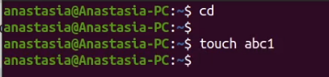
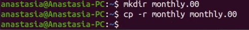
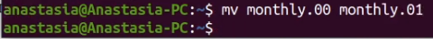
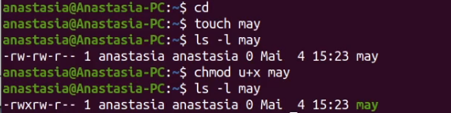
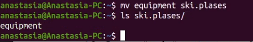
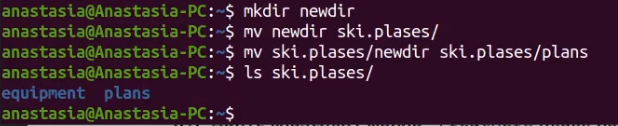
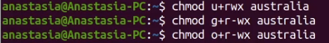
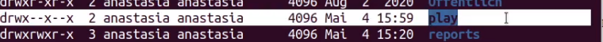
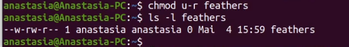

---
## Front matter
lang: ru-RU
title: Лабораторная работа No 5.
author: |
    Анастасия Павловна Баранова, НБИбд-01-21\inst{1}
institute: |
	\inst{1}Российский Университет Дружбы Народов
date: 29 апреля, Москва, 2022 г.

## Formatting
toc: false
slide_level: 2
theme: metropolis
header-includes: 
 - \metroset{progressbar=frametitle,sectionpage=progressbar,numbering=fraction}
 - '\makeatletter'
 - '\beamer@ignorenonframefalse'
 - '\makeatother'
aspectratio: 43
section-titles: true
---

# Анализ файловой системы Linux. Команды для работы с файлами и каталогами

## Цель работы

Целью данной работы является ознакомление с файловой системой Linux, её структурой, именами и содержанием каталогов. Приобретение практических навыков по применению команд для работы с файлами и каталогами, по управлению процессами (и работами), по проверке использования диска и обслуживанию файловой системы.

# Выполнение лабораторной работы

## Копирование файла в текущем каталоге.

Выполняю все примеры, приведённые в первой части описания лабораторной работы.

## Копирование файла в текущем каталоге.

## Копирование нескольких файлов в каталог

## Копирование файлов в произвольном каталоге

## Копирование каталогов в текущем каталоге

## Копирование каталогов в произвольном каталоге

## Переименование файлов в текущем каталоге

## Перемещение файлов в другой каталог

## Переименование каталогов в текущем каталоге

## Перемещение каталога в другой каталог

## Переименование каталога, не являющегося текущим

## Требуется создать файл ~/may с правом выполнения для владельца u+x

## Требуется лишить владельца файла ~/may права на выполнение

## Требуется создать каталог monthly с запретом на чтение для членов группы и всех остальных пользователей

## Требуется создать файл ~/abc1 с правом записи для членов группы

## Требуется создать файл ~/abc1 с правом записи для членов группы

## Выполню следующие действия, зафиксировав в отчёте по лабораторной работе используемые при этом команды и результаты их выполнения.

Скопирую файл /usr/include/sys/io.h в домашний каталог и назову его equipment. Если файла io.h нет, то использую любой другой файл в каталоге /usr/include/sys/ вместо него.

## Скопирую файл /usr/include/sys/io.h в домашний каталог

## Назову его equipment

## В домашнем каталоге создам директорию ~/ski.plases

В домашнем каталоге создам директорию ~/ski.plases.

## Переместим файл equipment в каталог ~/ski.plases.

Переместим файл equipment в каталог ~/ski.plases.

## Создам в домашнем каталоге файл abc1 и скопирую его в каталог ~/ski.plases, назову его equiplist2

Переименую файл ~/ski.plases/equipment в ~/ski.plases/equiplist. Создам в домашнем каталоге файл abc1 и скопирую его в каталог ~/ski.plases, назову его equiplist2.

## Создам каталог с именем equipment в каталоге ~/ski.plases

Создам каталог с именем equipment в каталоге ~/ski.plases.

## Переместим файлы ~/ski.plases/equiplist и equiplist2 в каталог ~/ski.plases/equipment

Переместим файлы ~/ski.plases/equiplist и equiplist2 в каталог ~/ski.plases/equipment.

## Создам и перемещу каталог ~/newdir в каталог ~/ski.plases и назову его plans

Создам и перемещу каталог ~/newdir в каталог ~/ski.plases и назову его plans.

## Определю опции команды chmod, необходимые для того, чтобы присвоить файлам выделенные права доступа, считая, что в начале таких прав нет

Присвою выделенные права доступа каталогу australia.

## Присвою выделенные права доступа каталогу australia

## Присвою выделенные права доступа каталогу play

Присвою выделенные права доступа каталогу play.

## Присвою выделенные права доступа каталогу play

## Присвою выделенные права доступа файлу my_os

Присвою выделенные права доступа файлу my_os.

## Присвою выделенные права доступа файлу my_os

## Присвою выделенные права доступа файлу feathers

Присвою выделенные права доступа файлу feathers.

## Присвою выделенные права доступа файлу feathers

## Проделаю приведённые ниже упражнения, записывая в отчёт по лабораторной работе используемые при этом команды

При помощи команды cat просмотрю содержимое файла /etc/passwd.

## При помощи команды cp скопирую файл ~/feathers в файл ~/file.old

При помощи команды cp скопирую файл ~/feathers в файл ~/file.old.

## При помощи команды mv перемещу файл ~/file.old в каталог ~/play

При помощи команды mv перемещу файл ~/file.old в каталог ~/play.

## При помощи команды cp скопирую каталог ~/play в каталог ~/fun

При помощи команды cp скопирую каталог ~/play в каталог ~/fun.

## При помощи команды mv перемещу каталог ~/fun в каталог ~/play и назову его games

При помощи команды mv перемещу каталог ~/fun в каталог ~/play и назову его games.

## Лишу владельца файла ~/feathers права на чтение. 

Лишу владельца файла ~/feathers права на чтение.

## Вот что произойдёт, если я попытаюсь просмотреть файл ~/feathers командой cat.

Вот что произойдёт, если я попытаюсь просмотреть файл ~/feathers командой cat.

## Вот что произойдёт, если я попытаюсь скопировать файл ~/feathers.

Вот что произойдёт, если я попытаюсь скопировать файл ~/feathers.

## Дам владельцу файла ~/feathers право на чтение

Дам владельцу файла ~/feathers право на чтение.

## Лишу владельца каталога ~/play права на выполнение

Лишу владельца каталога ~/play права на выполнение.

## Перейду в каталог ~/play. Вот что произошло.

Перейду в каталог ~/play. Вот что произошло.

## Дам владельцу каталога ~/play право на выполнение.

Дам владельцу каталога ~/play право на выполнение.

## Прочитаю man по командам mount, fsck, mkfs, kill.

Прочитаю man по командам mount, fsck, mkfs, kill.

## Прочитаю man по команде fsck

## Прочитаю man по команде mkfs

## Прочитаю man по команде kill

## Вывод

В ходе выполнения данной лабораторной работы я провела ознакомление с файловой системой Linux, её структурой, именами и содержанием каталогов. Приобрела практические навыки по применению команд для работы с файлами и каталогами, по управлению процессами (и работами), по проверке использования диска и обслуживанию файловой системы.