---
## Front matter
title: "ОТЧЕТ ПО ЛАБОРАТОРНОЙ РАБОТЕ №5"
subtitle: "Анализ файловой системы Linux. Команды для работы с файлами и каталогами"
author: "Анастасия Павловна Баранова, НБИбд-01-21"

## Generic otions
lang: ru-RU
toc-title: "Содержание"

## Bibliography
bibliography: bib/cite.bib
csl: pandoc/csl/gost-r-7-0-5-2008-numeric.csl

## Pdf output format
toc: true # Table of contents
toc-depth: 2
lof: true # List of figures
lot: true # List of tables
fontsize: 12pt
linestretch: 1.5
papersize: a4
documentclass: scrreprt
## I18n polyglossia
polyglossia-lang:
  name: russian
  options:
	- spelling=modern
	- babelshorthands=true
polyglossia-otherlangs:
  name: english
## I18n babel
babel-lang: russian
babel-otherlangs: english
## Fonts
mainfont: PT Serif
romanfont: PT Serif
sansfont: PT Sans
monofont: PT Mono
mainfontoptions: Ligatures=TeX
romanfontoptions: Ligatures=TeX
sansfontoptions: Ligatures=TeX,Scale=MatchLowercase
monofontoptions: Scale=MatchLowercase,Scale=0.9
## Biblatex
biblatex: true
biblio-style: "gost-numeric"
biblatexoptions:
  - parentracker=true
  - backend=biber
  - hyperref=auto
  - language=auto
  - autolang=other*
  - citestyle=gost-numeric
## Pandoc-crossref LaTeX customization
figureTitle: "Рис."
#tableTitle: "Таблица"
listingTitle: "Листинг"
lofTitle: "Список иллюстраций"
#lotTitle: "Список таблиц"
lolTitle: "Листинги"
## Misc options
indent: true
header-includes:
  - \usepackage{indentfirst}
  - \usepackage{float} # keep figures where there are in the text
  - \floatplacement{figure}{H} # keep figures where there are in the text
---

# Цель работы

Целью данной работы является ознакомление с файловой системой Linux, её структурой, именами и содержанием каталогов. Приобретение практических навыков по применению команд для работы с файлами и каталогами, по управлению процессами (и работами), по проверке использования диска и обслуживанию файловой системы.

# Задание

1. Выполните все примеры, приведённые в первой части описания лабораторной работы.
2. Выполните следующие действия, зафиксировав в отчёте по лабораторной работе используемые при этом команды и результаты их выполнения:
  1. Скопируйте файл /usr/include/sys/io.h в домашний каталог и назовите его equipment. Если файла io.h нет, то используйте любой другой файл в каталоге /usr/include/sys/ вместо него.
  2. В домашнем каталоге создайте директорию ~/ski.plases.
  3. Переместите файл equipment в каталог ~/ski.plases.
  4. Переименуйте файл ~/ski.plases/equipment в ~/ski.plases/equiplist.
  5. Создайте в домашнем каталоге файл abc1 и скопируйте его в каталог ~/ski.plases, назовите его equiplist2.
  6. Создайте каталог с именем equipment в каталоге ~/ski.plases.
  7. Переместите файлы ~/ski.plases/equiplist и equiplist2 в каталог ~/ski.plases/equipment.
  8. Создайте и переместите каталог ~/newdir в каталог ~/ski.plases и назовите его plans.
3. Определите опции команды chmod, необходимые для того, чтобы присвоить перечисленным ниже файлам выделенные права доступа, считая, что в начале таких прав нет:
  1. drwxr--r-- ... australia
  2. drwx--x--x ... play
  3. -r-xr--r-- ... my_os
  4. -rw-rw-r-- ... feathers
  При необходимости создайте нужные файлы.
4. Проделайте приведённые ниже упражнения, записывая в отчёт по лабораторной работе используемые при этом команды:
  1. Просмотрите содержимое файла /etc/password.
  2. Скопируйте файл ~/feathers в файл ~/file.old.
  3. Переместите файл ~/file.old в каталог ~/play.
  4. Скопируйте каталог ~/play в каталог ~/fun.
  5. Переместите каталог ~/fun в каталог ~/play и назовите его games.
  6. Лишите владельца файла ~/feathers права на чтение.
  7. Что произойдёт, если вы попытаетесь просмотреть файл ~/feathers командой cat?
  8. Что произойдёт, если вы попытаетесь скопировать файл ~/feathers?
  9. Дайте владельцу файла ~/feathers право на чтение.
  10. Лишите владельца каталога ~/play права на выполнение.
  11. Перейдите в каталог ~/play. Что произошло?
  12. Дайте владельцу каталога ~/play право на выполнение.
5. Прочитайте man по командам mount, fsck, mkfs, kill и кратко их охарактеризуйте, приведя примеры.

# Выполнение лабораторной работы

Выполняю все примеры, приведённые в первой части описания лабораторной работы. (рис. [-@fig:001] - рис. [-@fig:0016])

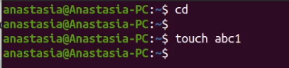{ #fig:001 width=70% }

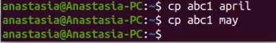{ #fig:002 width=70% }

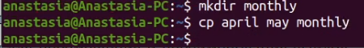{ #fig:003 width=70% }

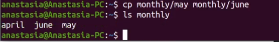{ #fig:004 width=70% }

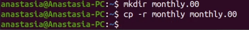{ #fig:005 width=70% }

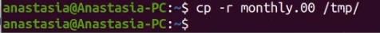{ #fig:006 width=70% }

{ #fig:007 width=70% }

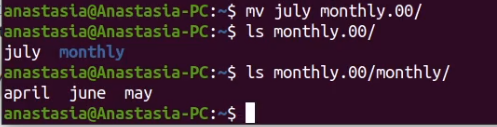{ #fig:008 width=70% }

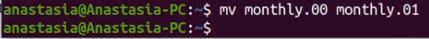{ #fig:009 width=70% }

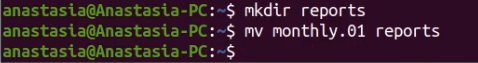{ #fig:010 width=70% }

{ #fig:011 width=70% }

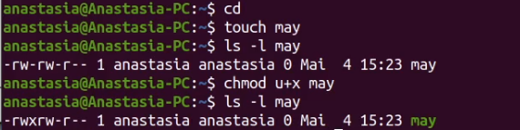{ #fig:012 width=70% }

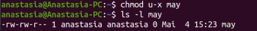{ #fig:013 width=70% }

{ #fig:014 width=70% }

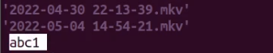{ #fig:015 width=70% }

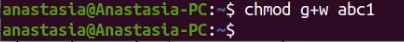{ #fig:016 width=70% }

Выполню следующие действия, зафиксировав в отчёте по лабораторной работе используемые при этом команды и результаты их выполнения.

Скопирую файл /usr/include/sys/io.h в домашний каталог и назову его equipment. Если файла io.h нет, то использую любой другой файл в каталоге /usr/include/sys/ вместо него. (рис. [-@fig:017], [-@fig:018])

{ #fig:0017 width=70% }

{ #fig:018 width=70% }

В домашнем каталоге создам директорию ~/ski.plases. (рис. [-@fig:019])

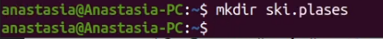{ #fig:019 width=70% }

Переместим файл equipment в каталог ~/ski.plases. (рис. [-@fig:020])

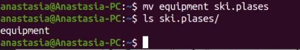{ #fig:020 width=70% }

Переименую файл ~/ski.plases/equipment в ~/ski.plases/equiplist. Создам в домашнем каталоге файл abc1 и скопирую его в каталог ~/ski.plases, назову его equiplist2.(рис. [-@fig:021])

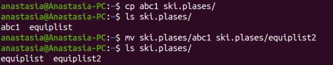{ #fig:021 width=70% }

Создам каталог с именем equipment в каталоге ~/ski.plases. (рис. [-@fig:022])

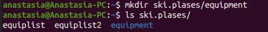{ #fig:022 width=70% }

Переместим файлы ~/ski.plases/equiplist и equiplist2 в каталог ~/ski.plases/equipment. (рис. [-@fig:023])

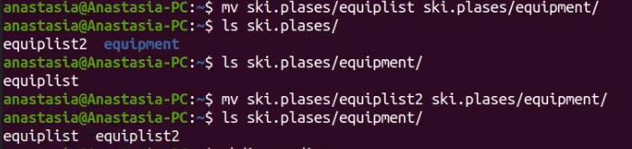{ #fig:023 width=70% }

Создам и перемещу каталог ~/newdir в каталог ~/ski.plases и назову его plans. (рис. [-@fig:024])

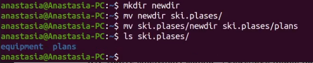{ #fig:024 width=70% }

Определю опции команды chmod, необходимые для того, чтобы присвоить файлам выделенные права доступа, считая, что в начале таких прав нет.

Присвою выделенные права доступа каталогу australia. (рис. [-@fig:025], [-@fig:026])

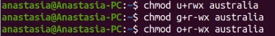{ #fig:025 width=70% }

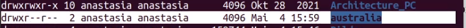{ #fig:026 width=70% }

Присвою выделенные права доступа каталогу play. (рис. [-@fig:027], [-@fig:028])

{ #fig:027 width=70% }

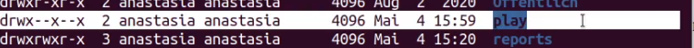{ #fig:028 width=70% }

Присвою выделенные права доступа файлу my_os. (рис. [-@fig:029], [-@fig:030])

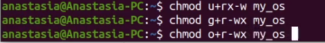{ #fig:029 width=70% }

{ #fig:030 width=70% }

Присвою выделенные права доступа файлу feathers. (рис. [-@fig:031], [-@fig:032])

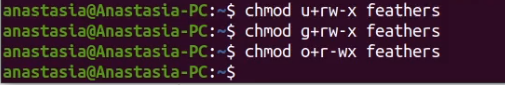{ #fig:031 width=70% }

{ #fig:032 width=70% }

Проделаю приведённые ниже упражнения, записывая в отчёт по лабораторной работе используемые при этом команды.
При помощи команды cat просмотрю содержимое файла /etc/passwd. (рис. [-@fig:033])

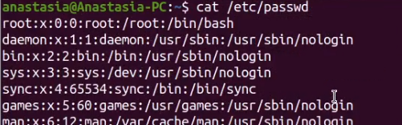{ #fig:033 width=70% }

При помощи команды cp скопирую файл ~/feathers в файл ~/file.old. (рис. [-@fig:034])

{ #fig:034 width=70% }

При помощи команды mv перемещу файл ~/file.old в каталог ~/play. (рис. [-@fig:035])

{ #fig:035 width=70% }

При помощи команды cp скопирую каталог ~/play в каталог ~/fun. (рис. [-@fig:036])

{ #fig:036 width=70% }

При помощи команды mv перемещу каталог ~/fun в каталог ~/play и назову его games. (рис. [-@fig:037])

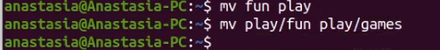{ #fig:037 width=70% }

Лишу владельца файла ~/feathers права на чтение. (рис. [-@fig:037])

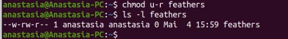{ #fig:038 width=70% }

Вот что произойдёт, если я попытаюсь просмотреть файл ~/feathers командой cat. (рис. [-@fig:039])

{ #fig:039 width=70% }

Вот что произойдёт, если я попытаюсь скопировать файл ~/feathers. (рис. [-@fig:040])

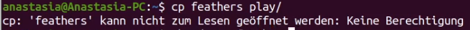{ #fig:040 width=70% }

Дам владельцу файла ~/feathers право на чтение. (рис. [-@fig:041])

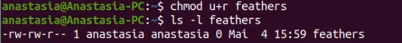{ #fig:041 width=70% }

Лишу владельца каталога ~/play права на выполнение. (рис. [-@fig:042])

{ #fig:042 width=70% }

Перейду в каталог ~/play. Вот что произошло. (рис. [-@fig:043])

{ #fig:043 width=70% }

Дам владельцу каталога ~/play право на выполнение. (рис. [-@fig:044])

{ #fig:044 width=70% }

Прочитаю man по командам mount, fsck, mkfs, kill. (рис. [-@fig:045], [-@fig:046], [-@fig:047], [-@fig:048])

{ #fig:045 width=70% }

{ #fig:046 width=70% }

{ #fig:047 width=70% }

{ #fig:048 width=70% }

# Контрольные вопросы

1. Дайте характеристику каждой файловой системе, существующей на жёстком диске компьютера, на котором вы выполняли лабораторную работу.
  Ответ: Характеристика файловой системы, которая использовалась в данной лабо-
  раторной работе: Файлы: abc1, april, may, june, july, isdv4.h, equipment, equiplist,
  equiplist2, my_os, feathers, file.old. Каталоги: monthly, monthly.00, tmp, monthly.01,
  reports, usr, ski.plases, equipment, newdir, plans, australia, play, etc, fun, games.
2. Приведите общую структуру файловой системы и дайте характеристику каждой директории первого уровня этой структуры.
  Ответ: Пример общей структуры файловой системы: /home/pdarzhankina/monthly/april,
  где /home/pdarzhankina – домашний каталог, /monthly – каталог, находящийся в
  домашнем и содержащий файл, /аpril – файл, находящийся в каталоге.
3. Какая операция должна быть выполнена, чтобы содержимое некоторой файловой системы было доступно операционной системе?
  Ответ: Чтобы содержимое некоторой файловой системы было доступно операционной системе должно быть выполнено монтирование тома.
4. Назовите основные причины нарушения целостности файловой системы. Как устранить повреждения файловой системы?
  Ответ: Основные причины нарушения целостности файловой системы:
  - Один блок адресуется несколькими mode (принадлежит нескольким фай-
  лам).
  - Блок помечен как свободный, но в то же время занят (на него ссылается
  onode).
  - Блок помечен как занятый, но в то же время свободен (ни один inode на
  него не ссылается).
  - Неправильное число ссылок в inode (недостаток или избыток ссылающихся
  записей в каталогах).
  - Несовпадение между размером файла и суммарным размером адресуемых
  inode блоков.
  - Недопустимые адресуемые блоки (например, расположенные за пределами
  файловой системы).
  - “Потерянные” файлы (правильные inode, на которые не ссылаются записи
  каталогов).
  - Недопустимые или неразмещенные номера inode в записях каталогов. Что-
  бы устранить повреждения файловой системы используется команда fsck.
5. Как создаётся файловая система?
  Ответ: Команда mkfs создаёт новую файловую систему.
6. Дайте характеристику командам для просмотра текстовых файлов.
  Ответ: Характеристика команд, которые позволяют просмотреть текстовые файлы:
  - для просмотра небольших файлов удобно пользоваться командой cat.
  - для просмотра больших файлов используйте команду less — она позволяет
  осуществлять постраничный просмотр файлов.
  - для просмотра начала файла можно воспользоваться командой head, по
  умолчанию она выводит первые 10 строк файла.
  - команда tail выводит несколько (по умолчанию 10) последних строк файла.
7. Приведите основные возможности команды cp в Linux.
  Ответ: Основные возможности команды cp:
  - копирование файла в текущем каталоге.
  - копирование нескольких файлов в каталог.
  - копирование файлов в произвольном каталоге. Опция i в команде cp выведет на экран запрос подтверждения о перезаписи файла, если на место целевого файла вы поставите имя уже существующего файла. Команда cp с опцией r (recursive) позволяет копировать каталоги вместе с входящими в них файлами и каталогами.
8. Приведите основные возможности команды mv в Linux.
  Ответ: Характеристика команд перемещения и переименования файлов и катало-
  гов:
  - переименование файлов в текущем каталоге. mv
  - перемещение файлов в другой каталог. mv Если необходим запрос подтверждения о перезаписи файла, то нужно использовать опцию i.
  - переименование каталогов в текущем каталоге. mv
  - перемещение каталога в другой каталог. mv
  - переименование каталога, не являющегося текущим. mv <каталог/новое_на звание_каталога>
9. Что такое права доступа? Как они могут быть изменены?
  Ответ: Каждый файл или каталог имеет права доступа: чтение (разрешены просмотр и копирование файла, разрешён просмотр списка входящих в каталог файлов), запись (разрешены изменение и переименование файла, разрешены создание и удаление файлов каталога), выполнение (разрешено
  выполнение файла, разрешён доступ в каталог и есть возможность сделать его текущим). Они могу быть изменены командой chmod.

# Вывод

В ходе выполнения данной лабораторной работы я провела ознакомление с файловой системой Linux, её структурой, именами и содержанием каталогов. Приобрела практические навыки по применению команд для работы с файлами и каталогами, по управлению процессами (и работами), по проверке использования диска и обслуживанию файловой системы.
