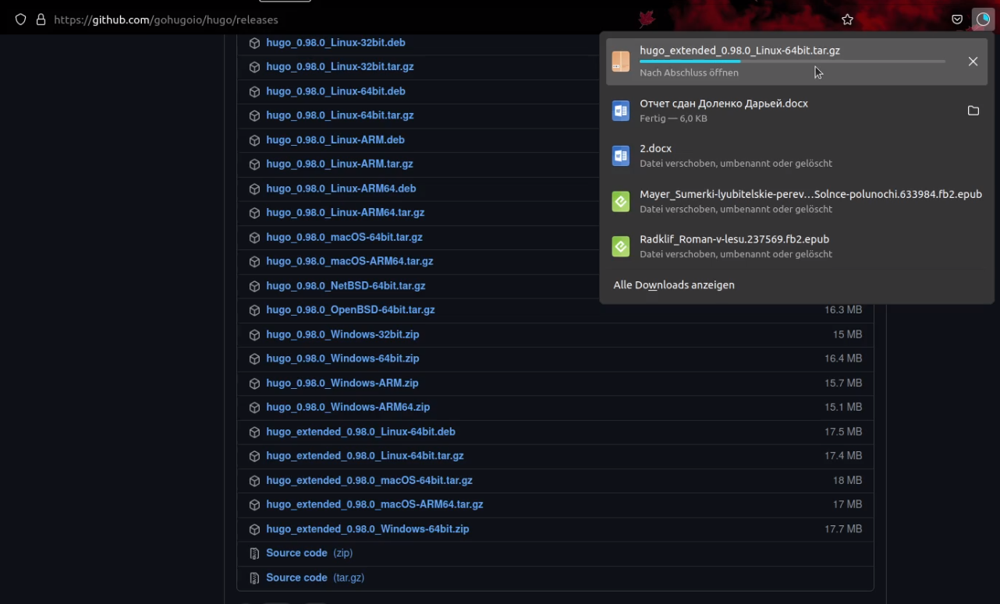
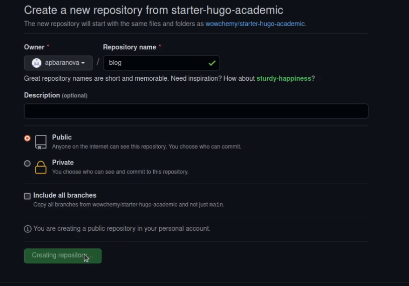
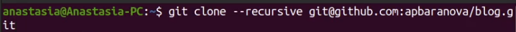
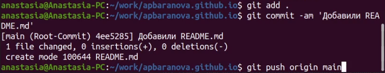
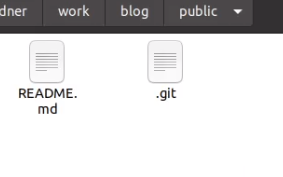
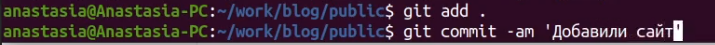
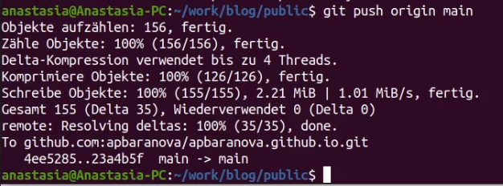

---
## Front matter
title: "Первый этап индивидуального проекта"
subtitle: "Создание сайта"
author: "Баранова Анастасия, НБИбд-01-21"

## Generic otions
lang: ru-RU
toc-title: "Содержание"

## Bibliography
bibliography: bib/cite.bib
csl: pandoc/csl/gost-r-7-0-5-2008-numeric.csl

## Pdf output format
toc: true # Table of contents
toc-depth: 2
lof: true # List of figures
lot: true # List of tables
fontsize: 12pt
linestretch: 1.5
papersize: a4
documentclass: scrreprt
## I18n polyglossia
polyglossia-lang:
  name: russian
  options:
	- spelling=modern
	- babelshorthands=true
polyglossia-otherlangs:
  name: english
## I18n babel
babel-lang: russian
babel-otherlangs: english
## Fonts
mainfont: PT Serif
romanfont: PT Serif
sansfont: PT Sans
monofont: PT Mono
mainfontoptions: Ligatures=TeX
romanfontoptions: Ligatures=TeX
sansfontoptions: Ligatures=TeX,Scale=MatchLowercase
monofontoptions: Scale=MatchLowercase,Scale=0.9
## Biblatex
biblatex: true
biblio-style: "gost-numeric"
biblatexoptions:
  - parentracker=true
  - backend=biber
  - hyperref=auto
  - language=auto
  - autolang=other*
  - citestyle=gost-numeric
## Pandoc-crossref LaTeX customization
figureTitle: "Рис."
tableTitle: "Таблица"
listingTitle: "Листинг"
lofTitle: "Список иллюстраций"
lotTitle: "Список таблиц"
lolTitle: "Листинги"
## Misc options
indent: true
header-includes:
  - \usepackage{indentfirst}
  - \usepackage{float} # keep figures where there are in the text
  - \floatplacement{figure}{H} # keep figures where there are in the text
---

# Цель работы

Загрузка шаблона сайта на репозиторий и гит и синхронизация сайта с гит.

# Задание

Размещение на Github pages заготовки для персонального сайта.

  - Установить необходимое программное обеспечение.
  - Скачать шаблон темы сайта.
  - Разместить его на хостинге git.
  - Установить параметр для URLs сайта.
  - Разместить заготовку сайта на Github pages.

# Выполнение работы 
# Установил необходимое программное обеспечение

# Использую команду ~/bin/hugo, чтобы скопировать ссылку на сайт. Все получилось

# Далее перехожу в гитхаб и создаю еще один репозиторий, у меня он уже создан

# Клонируем данный репозиторий

# Переключаюсь на новую ветку и ввожу команды get add, git commit -am, git push

 
# Далее клонируем и в папке гитигнор комментируем public и теперь в нашей папке есть файл README.md

# Ввожу команду bin/hugo

# Теперь этот каталог подключен к нашему репозиторию и проделываем стандартный действия

# Копирую ссылку из своего гитхаба и вставляю в поисковик, все получилось

# Выводы
Я научилась работать и создавать сайты и синхронизировать его с гитхабом.

