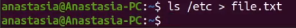
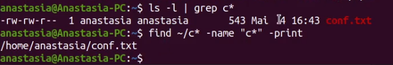
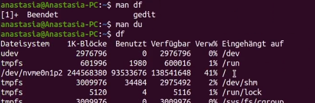

---
## Front matter
lang: ru-RU
title: Лабораторная работа No 6.
author: |
    Анастасия Павловна Баранова, НБИбд-01-21\inst{1}
institute: |
	\inst{1}Российский Университет Дружбы Народов
date: 7 мая, Москва, 2022 г.

## Formatting
toc: false
slide_level: 2
theme: metropolis
header-includes: 
 - \metroset{progressbar=frametitle,sectionpage=progressbar,numbering=fraction}
 - '\makeatletter'
 - '\beamer@ignorenonframefalse'
 - '\makeatother'
aspectratio: 43
section-titles: true
---

# Поиск файлов. Перенаправление ввода-вывода. Просмотр запущенных процессов

## Цель работы

Целью данной работы является  ознакомление с инструментами поиска файлов и фильтрации текстовых данных и приобретение практических навыков: по управлению процессами (и заданиями), по проверке использования диска и обслуживанию файловых систем.

# Выполнение лабораторной работы

## Записываю в файл file.txt названия файлов, содержащихся в каталоге /etc.

Осуществляю вход в систему, используя соответствующее имя пользователя. Записываю в файл file.txt названия файлов, содержащихся в каталоге /etc.

## Дописываю в этот же файл названия файлов, содержащихся в вашем домашнем каталоге.

Дописываю в этот же файл названия файлов, содержащихся в вашем домашнем каталоге.

## Вывожу имена всех файлов из file.txt, имеющих расширение .conf, после чего записываю их в новый текстовой файл conf.txt.

Вывожу имена всех файлов из file.txt, имеющих расширение .conf, после чего записываю их в новый текстовой файл conf.txt.

## Записываю их в новый текстовой файл conf.txt

## Определяю, какие файлы в моём домашнем каталоге имеют имена, начинавшиеся с символа c

Двумя разными способами определяю, какие файлы в моём домашнем каталоге имеют имена, начинавшиеся с символа c.

## Вывожу на экран (по странично) имена файлов из каталога /etc, начинающиеся с символа h

Вывожу на экран (по странично) имена файлов из каталога /etc, начинающиеся с символа h.

## Вывожу на экран (по странично) имена файлов из каталога /etc, начинающиеся с символа h

## Запущу в фоновом режиме процесс, который будет записывать в файл ~/logfile файлы, имена которых начинаются с log

Запущу в фоновом режиме процесс, который будет записывать в файл ~/logfile файлы, имена которых начинаются с log.

## Удалю файл ~/logfile

Удалю файл ~/logfile.

## Запущу из консоли в фоновом режиме редактор gedit

Запущу из консоли в фоновом режиме редактор gedit.

## Определю идентификатор процесса gedit, используя команду ps, конвейер и фильтр grep

Определю идентификатор процесса gedit, используя команду ps, конвейер и фильтр grep.

## Прочитаю справку (man) команды kill, после чего используйте её для завершения процесса gedit

Прочитаю справку (man) команды kill, после чего используйте её для завершения процесса gedit.

## Выполню команды df и du, предварительно получив более подробную информацию об этих командах, с помощью команды man

Выполню команды df и du, предварительно получив более подробную информацию об этих командах, с помощью команды man.

## Воспользовавшись справкой команды find, выведу имена всех директорий, имеющихся в моём домашнем каталоге

Воспользовавшись справкой команды find, выведу имена всех директорий, имеющихся в моём домашнем каталоге.

## Вывод

В ходе выполнения данной лабораторной работы я ознакомилась с инструментами поиска файлов и фильтрации текстовых данных и приобрела практические навыки: по управлению процессами (и заданиями), по проверке использования диска и обслуживанию файловых систем.