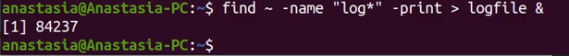

---
## Front matter
title: "ОТЧЕТ ПО ЛАБОРАТОРНОЙ РАБОТЕ №6"
subtitle: "Поиск файлов. Перенаправление ввода-вывода. Просмотр запущенных процессов"
author: "Анастасия Павловна Баранова, НБИбд-01-21"

## Generic otions
lang: ru-RU
toc-title: "Содержание"

## Bibliography
bibliography: bib/cite.bib
csl: pandoc/csl/gost-r-7-0-5-2008-numeric.csl

## Pdf output format
toc: true # Table of contents
toc-depth: 2
lof: true # List of figures
lot: true # List of tables
fontsize: 12pt
linestretch: 1.5
papersize: a4
documentclass: scrreprt
## I18n polyglossia
polyglossia-lang:
  name: russian
  options:
	- spelling=modern
	- babelshorthands=true
polyglossia-otherlangs:
  name: english
## I18n babel
babel-lang: russian
babel-otherlangs: english
## Fonts
mainfont: PT Serif
romanfont: PT Serif
sansfont: PT Sans
monofont: PT Mono
mainfontoptions: Ligatures=TeX
romanfontoptions: Ligatures=TeX
sansfontoptions: Ligatures=TeX,Scale=MatchLowercase
monofontoptions: Scale=MatchLowercase,Scale=0.9
## Biblatex
biblatex: true
biblio-style: "gost-numeric"
biblatexoptions:
  - parentracker=true
  - backend=biber
  - hyperref=auto
  - language=auto
  - autolang=other*
  - citestyle=gost-numeric
## Pandoc-crossref LaTeX customization
figureTitle: "Рис."
#tableTitle: "Таблица"
listingTitle: "Листинг"
lofTitle: "Список иллюстраций"
#lotTitle: "Список таблиц"
lolTitle: "Листинги"
## Misc options
indent: true
header-includes:
  - \usepackage{indentfirst}
  - \usepackage{float} # keep figures where there are in the text
  - \floatplacement{figure}{H} # keep figures where there are in the text
---

# Цель работы

Целью данной работы является ознакомление с инструментами поиска файлов и фильтрации текстовых данных и приобретение практических навыков: по управлению процессами (и заданиями), по проверке использования диска и обслуживанию файловых систем.

# Задание

1. Осуществите вход в систему, используя соответствующее имя пользователя.
2. Запишите в файл file.txt названия файлов, содержащихся в       каталоге /etc. Допишите в этот же файл названия файлов, содержащихся в вашем домашнем каталоге.
3. Выведите имена всех файлов из file.txt, имеющих расширение .conf, после чего запишите их в новый текстовой файл conf.txt.
4. Определите, какие файлы в вашем домашнем каталоге имеют имена, начинавшиеся с символа c? Предложите несколько вариантов, как это сделать.
5. Выведите на экран (по странично) имена файлов из каталога /etc, начинающиеся с символа h.
6. Запустите в фоновом режиме процесс, который будет записывать в файл ~/logfile файлы, имена которых начинаются с log.
7. Удалите файл ~/logfile.
8. Запустите из консоли в фоновом режиме редактор gedit.
9. Определите идентификатор процесса gedit, используя команду ps, конвейер и фильтр grep. Как ещё можно определить идентификатор процесса?
10. Прочтите справку (man) команды kill, после чего используйте её для завершения процесса gedit.
11. Выполните команды df и du, предварительно получив более подробную информацию об этих командах, с помощью команды man.
12. Воспользовавшись справкой команды find, выведите имена всех директорий, имеющихся в вашем домашнем каталоге.

# Выполнение лабораторной работы

Осуществляю вход в систему, используя соответствующее имя пользователя. Записываю в файл file.txt названия файлов, содержащихся в каталоге /etc. (рис. [-@fig:001])

{ #fig:001 width=70% }

Дописываю в этот же файл названия файлов, содержащихся в вашем домашнем каталоге. (рис. [-@fig:002])

{ #fig:002 width=70% }

Вывожу имена всех файлов из file.txt, имеющих расширение .conf, после чего записываю их в новый текстовой файл conf.txt. (рис. [-@fig:003], [-@fig:004])

{ #fig:003 width=70% }

{ #fig:004 width=70% }

Двумя разными способами определяю, какие файлы в моём домашнем каталоге имеют имена, начинавшиеся с символа c. (рис. [-@fig:005])

{ #fig:005 width=70% }

Вывожу на экран (по странично) имена файлов из каталога /etc, начинающиеся с символа h.(рис. [-@fig:006], [-@fig:007])

{ #fig:006 width=70% }

{ #fig:007 width=70% }

Запущу в фоновом режиме процесс, который будет записывать в файл ~/logfile файлы, имена которых начинаются с log. (рис. [-@fig:008])

{ #fig:008 width=70% }

Удалю файл ~/logfile. (рис. [-@fig:009])

{ #fig:009 width=70% }

Запущу из консоли в фоновом режиме редактор gedit. (рис. [-@fig:010])

{ #fig:010 width=70% }

Определю идентификатор процесса gedit, используя команду ps, конвейер и фильтр grep. (рис. [-@fig:011])

{ #fig:011 width=70% }

Прочитаю справку (man) команды kill, после чего используйте её для завершения процесса gedit. (рис. [-@fig:012])

{ #fig:012 width=70% }

Выполню команды df и du, предварительно получив более подробную информацию об этих командах, с помощью команды man. (рис. [-@fig:013])

{ #fig:013 width=70% }

Воспользовавшись справкой команды find, выведу имена всех директорий, имеющихся в моём домашнем каталоге. (рис. [-@fig:014])

{ #fig:014 width=70% }

# Контрольные вопросы

1. Какие потоки ввода вывода вы знаете?
  Ответ: В системе по умолчанию открыто три специальных потока: – stdin — стандартный поток ввода (по умолчанию: клавиатура), файловый дескриптор 0; – stdout — стандартный поток вывода (по умолчанию: консоль), файловый дескриптор 1; – stderr — стандартный поток вывод сообщений об ошибках (по умолчанию: консоль), файловый дескриптор 2.
2. Объясните разницу между операцией > и >>.
  Ответ: 
  - перенаправление stdout (вывода) в файл. Если файл отсутствовал, то он создаётся, иначе - перезаписывается.
  - перенаправление stdout (вывода) в файл. Если файл отсутствовал, то он создаётся, иначе - добавляется.
3. Что такое конвейер?
  Ответ: Конвейер (pipe) служит для объединения простых команд или утилит в цепочки, в которых результат работы предыдущей команды передаётся последующей.
4. Что такое процесс? Чем это понятие отличается от программы?
  Ответ: Процесс это - совокупность программного кода и данных, загруженных в память ЭВМ. Любой команде, выполняемой в системе, присваивается идентификатор процесса (process ID). Получить информацию о процессе и управлять им, пользуясь идентификатором процесса, можно из любого окна командного интерпретатора. Процессом называют выполняющуюся программу и все её элементы: адресное пространство, глобальные переменные, регистры, стек, открытые файлы и так далее.
5. Что такое PID и GID?
  Ответ: PID — уникальный номер (идентификатор) процесса в многозадачной ОС. GID – идентификатор группы.
6. Что такое задачи и какая команда позволяет ими управлять?
  Ответ: Любую выполняющуюся в консоли команду или внешнюю программу можно запустить в фоновом режиме. Запущенные фоном программы называются задачами (jobs). Ими можно управлять с помощью команды jobs, которая выводит список запущенных в данный момент задач. Для завершения задачи необходимо выполнить команду kill %номер задачи.
7. Найдите информацию об утилитах top и htop. Каковы их функции?
  Ответ: Команда top в Linux системах позволяет вывести в виде таблицы перечень запущенных процессов и оценить, какой объем ресурсов они потребляют, т.е., какую нагрузку создают на сервер и дисковую подсистему. Команда htop — продвинутый монитор процессов, показывает динамический список системных процессов, список обычно выравнивается по использованию ЦПУ. В отличие от top, htop показывает все процессы в системе. Также показывает время непрерывной работы, использование процессоров и памяти. htop часто применяется в тех случаях, когда информации даваемой утилитой top недостаточно, например при поиске утечек памяти в процессах.
8. Назовите и дайте характеристику команде поиска файлов. Приведите примеры использования этой команды.
  Ответ: Команда find используется для поиска и отображения имён файлов, соответствующих заданной строке символов. Формат команды: find путь [-опции]
  Путь определяет каталог, начиная с которого по всем подкаталогам будет вестись поиск. Примеры:
  - вывести на экран имена файлов из вашего домашнего каталога и его подкаталогов, начинающихся на f: find ~ -name “f*” -print
  - вывести на экран имена файлов в каталоге /etc, начинающихся с символа p: find /etc -name “p*” -print
  - найти в вашем домашнем каталоге файлы, имена которых заканчиваются символом и удалить их: find ~ -name “*~” -exec rm “{}” ;
9. Можно ли по контексту (содержанию) найти файл? Если да, то как?
  Ответ: Найти файл по контексту (содержанию) позволяет команда grep. Формат команды: grep строка имя_файла Примеры:
  - показать строки во всех файлах в вашем домашнем каталоге с именами, начинающимися на f, в которых есть слово begin: grep begin f*
  - найти в текущем каталоге все файлы, в имени которых есть буквосочетание «лаб»: ls -l | grep лаб
10. Как определить объем свободной памяти на жёстком диске?
  Ответ: Определить объем свободной памяти на жёстком диске позволяет команда df.
11. Как определить объем вашего домашнего каталога?
  Ответ: Определить объем домашнего каталога позволяет команда df /home/
12. Как удалить зависший процесс?
  Ответ: Удалить зависший процесс можно командой kill %номер задачи.

# Вывод

В ходе выполнения данной лабораторной работы я ознакомилась с инструментами поиска файлов и фильтрации текстовых данных и приобрела практические навыки: по управлению процессами (и заданиями), по проверке использования диска и обслуживанию файловых систем.