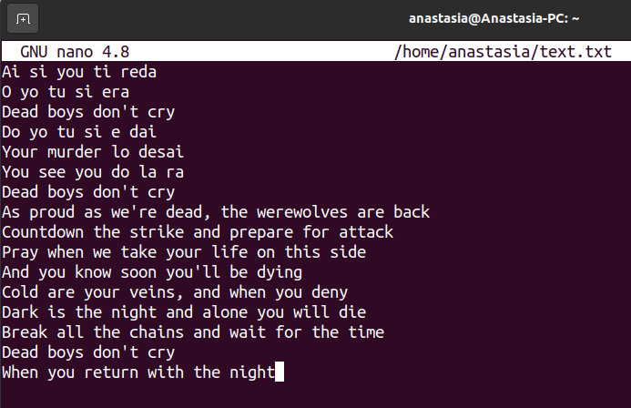
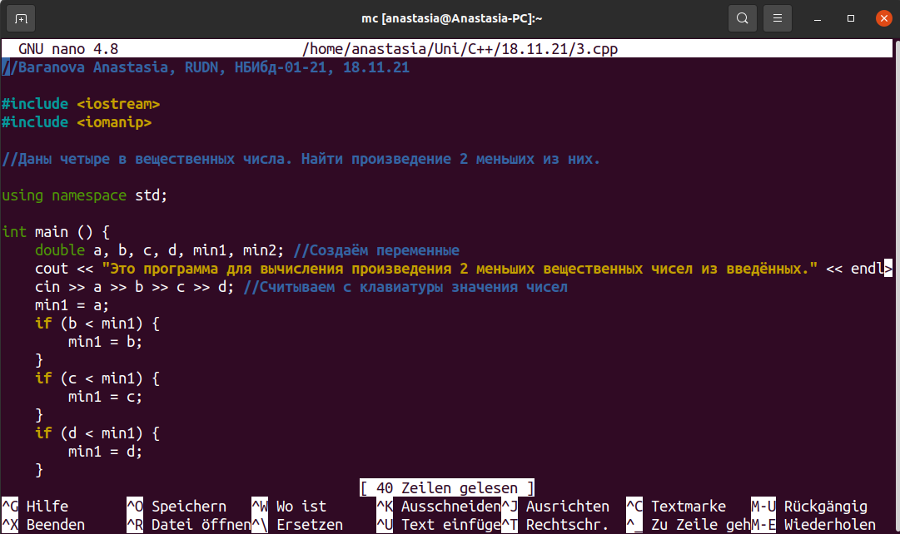

---
## Front matter
lang: ru-RU
title: Лабораторная работа No 7.
author: |
    Анастасия Павловна Баранова, НБИбд-01-21\inst{1}
institute: |
	\inst{1}Российский Университет Дружбы Народов
date: 11 мая, Москва, 2022 г.

## Formatting
toc: false
slide_level: 2
theme: metropolis
header-includes: 
 - \metroset{progressbar=frametitle,sectionpage=progressbar,numbering=fraction}
 - '\makeatletter'
 - '\beamer@ignorenonframefalse'
 - '\makeatother'
aspectratio: 43
section-titles: true
---

# Командная оболочка Midnight Commander

## Цель работы

Целью данной работы является освоение основных возможностей командной оболочки Midnight Commander. Приобретение навыков практической работы по просмотру каталогов и файлов; манипуляций с ними.

# Выполнение лабораторной работы

## Изучу информацию о mc, вызвав в командной строке man mc.

Изучу информацию о mc, вызвав в командной строке man mc.

## Запущу из командной строки mc, изучу его структуру и меню.

Запущу из командной строки mc, изучу его структуру и меню.

## Выполню несколько операций в mc, используя управляющие клавиши

Выполню несколько операций в mc, используя управляющие клавиши (операции с панелями; выделение/отмена выделения файлов, копирование/перемещение файлов, получение информации о размере и правах доступа на файлы и/или каталоги и т.п.).

## Выполню несколько операций в mc, используя управляющие клавиши

## Выполню несколько операций в mc, используя управляющие клавиши

## Выполню основные команды меню левой (или правой) панели

Выполню основные команды меню левой (или правой) панели. Вывод информации о файлах достаточно подробный.

## Выполню основные команды меню левой (или правой) панели

## Используя возможности подменю Файл, выполню:

Просмотр содержимого текстового файла.

## Используя возможности подменю Файл, выполню:

Просмотр содержимого текстового файла.

## Используя возможности подменю Файл, выполню:

Редактирование содержимого текстового файла (без сохранения результатов редактирования)

## Используя возможности подменю Файл, выполню:

Создание каталога.

## Используя возможности подменю Файл, выполню:

Копирование в файлов в созданный каталог.

## С помощью соответствующих средств подменю Команда осуществлю:

Поиск в файловой системе файла с заданными условиями (например, файла с расширением .c или .cpp, содержащего строку main)

## С помощью соответствующих средств подменю Команда осуществлю:

Поиск в файловой системе файла с заданными условиями.

## С помощью соответствующих средств подменю Команда осуществлю:

Выбор и повторение одной из предыдущих команд.

## С помощью соответствующих средств подменю Команда осуществлю:

Переход в домашний каталог.

## С помощью соответствующих средств подменю Команда осуществлю:

Переход в домашний каталог.

## С помощью соответствующих средств подменю Команда осуществлю:

Анализ файла меню и файла расширений.

## С помощью соответствующих средств подменю Команда осуществлю:

Анализ файла меню и файла расширений.

## С помощью соответствующих средств подменю Команда осуществлю:

Анализ файла меню и файла расширений.

## С помощью соответствующих средств подменю Команда осуществлю:

Анализ файла меню и файла расширений.

## Вызову подменю Настройки

Вызову подменю Настройки. Освою операции, определяющие структуру экрана mc (Full screen, Double Width, Show Hidden Files и т.д.).

## Создам текстовой файл text.txt

Создам текстовой файл text.txt.

## Открою этот файл с помощью встроенного в mc редактора

Открою этот файл с помощью встроенного в mc редактора.

## Вставлю в открытый файл небольшой фрагмент текста, скопированный из Интернета

Вставлю в открытый файл небольшой фрагмент текста, скопированный из Интернета.

## Проделаю с текстом следующие манипуляции, используя горячие клавиши:

Удалю строку текста.

## Проделаю с текстом следующие манипуляции, используя горячие клавиши:

Выделю фрагмент текста и скопирую его на новую строку.

## Проделаю с текстом следующие манипуляции, используя горячие клавиши:

Выделю фрагмент текста и скопирую его на новую строку.

## Проделаю с текстом следующие манипуляции, используя горячие клавиши:

Выделю фрагмент текста и перенесу его на новую строку.

## Проделаю с текстом следующие манипуляции, используя горячие клавиши:

Выделю фрагмент текста и перенесу его на новую строку.

## Проделаю с текстом следующие манипуляции, используя горячие клавиши:

Сохраню файл.

## Проделаю с текстом следующие манипуляции, используя горячие клавиши:

Отменю последнее действие.

## Проделаю с текстом следующие манипуляции, используя горячие клавиши:

Перейду в конец файла (нажав комбинацию клавиш) и напишу некоторый текст.

## Проделаю с текстом следующие манипуляции, используя горячие клавиши:

Перейду в начало файла (нажав комбинацию клавиш) и напишу некоторый текст.

## Проделаю с текстом следующие манипуляции, используя горячие клавиши:

Сохраню и закрою файл.

## Открою файл с исходным текстом на некотором языке программирования (С++)

Открою файл с исходным текстом на некотором языке программирования (С++).

## Используя меню редактора, включю подсветку синтаксиса

Используя меню редактора, включю подсветку синтаксиса.

## Вывод

В ходе выполнения данной лабораторной работы я освоила основные возможности командной оболочки Midnight Commander. Приобрела навыки практической работы по просмотру каталогов и файлов; манипуляций с ними.