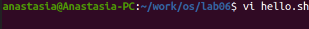
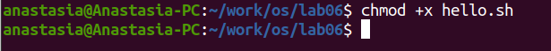
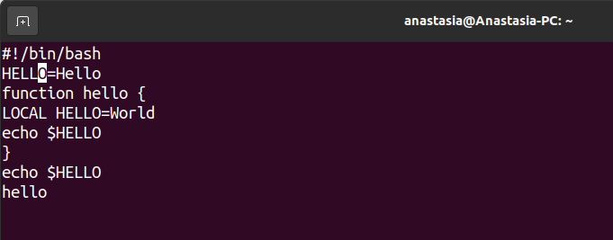
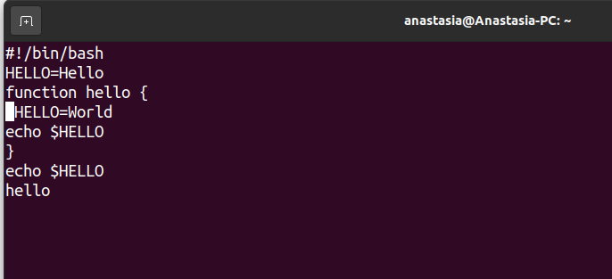
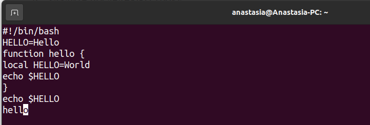
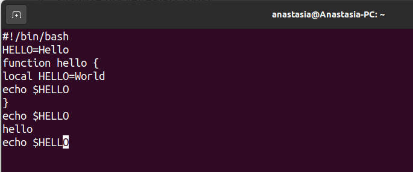
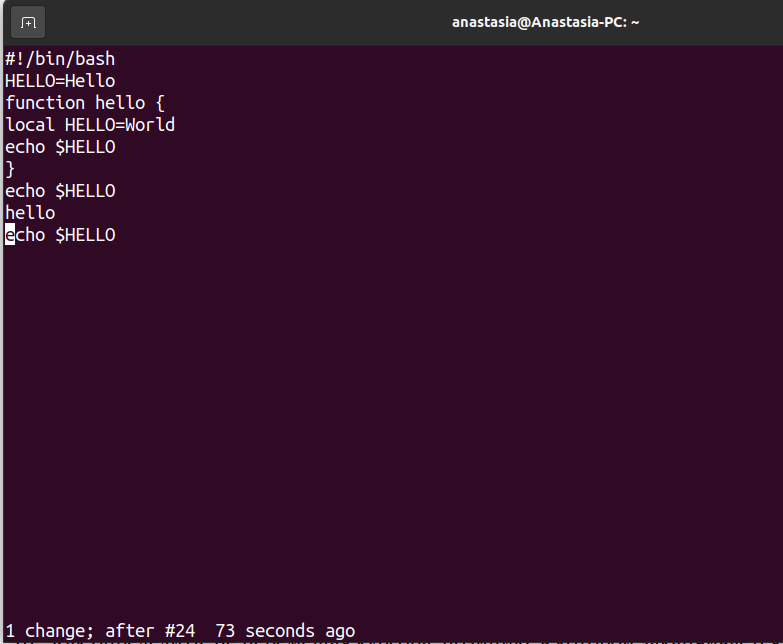
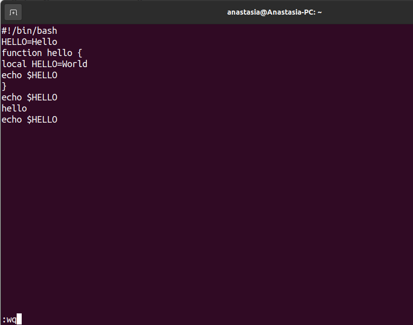

---
## Front matter
lang: ru-RU
title: Лабораторная работа No 8.
author: |
    Анастасия Павловна Баранова, НБИбд-01-21\inst{1}
institute: |
	\inst{1}Российский Университет Дружбы Народов
date: 11 мая, Москва, 2022 г.

## Formatting
toc: false
slide_level: 2
theme: metropolis
header-includes: 
 - \metroset{progressbar=frametitle,sectionpage=progressbar,numbering=fraction}
 - '\makeatletter'
 - '\beamer@ignorenonframefalse'
 - '\makeatother'
aspectratio: 43
section-titles: true
---

# Текстовой редактор vi

## Цель работы

Целью данной работы является знакомство с операционной системой Linux и получение практических навыков работы с редактором vi, установленным по умолчанию практически во всех дистрибутивах.

# Выполнение лабораторной работы

## Создам каталог с именем ~/work/os/lab06

Создам каталог с именем ~/work/os/lab06.

## Перейду во вновь созданный каталог

Перейду во вновь созданный каталог.

## Вызову vi и создам файл hello.sh.

Вызову vi и создам файл hello.sh.

## Нажму клавишу i и введу нужный текст

Нажму клавишу i и введу нужный текст.

## Нажму клавишу Esc для перехода в командный режим после завершения ввода текста

Нажму клавишу Esc для перехода в командный режим после завершения ввода текста.

## Нажму : для перехода в режим последней строки и внизу моего экрана появится приглашение в виде двоеточия

Нажму : для перехода в режим последней строки и внизу моего экрана появится приглашение в виде двоеточия.

## Нажму w (записать) и q (выйти), а затем завершу работу

Нажму w (записать) и q (выйти), а затем нажму клавишу Enter для сохранения моего текста и завершения работы.

## Сделаю файл исполняемым.

Сделаю файл исполняемым.

## Вызову vi на редактирование файла.

Вызову vi на редактирование файла.

## Установлю курсор в конец слова HELL второй строки.

Установлю курсор в конец слова HELL второй строки.

## Перейду в режим вставки и заменю на HELLO. Нажму Esc для возврата в командный режим.

Перейду в режим вставки и заменю на HELLO. Нажму Esc для возврата в командный режим.

## Установлю курсор на четвертую строку и сотру слово LOCAL.

Установлю курсор на четвертую строку и сотру слово LOCAL.

## Перейду в режим вставки и наберу следующий текст: local, нажму Esc для возврата в командный режим.

Перейду в режим вставки и наберу следующий текст: local, нажму Esc для возврата в командный режим.

## Установлю курсор на последней строке файла. Вставлю после неё строку

Установлю курсор на последней строке файла. 

## Установлю курсор на последней строке файла. Вставлю после неё строку

Вставлю после неё строку, содержащую следующий текст: echo $HELLO.

## Нажму Esc для перехода в командный режим.

Нажму Esc для перехода в командный режим.

## Удалю последнюю строку.

Удалю последнюю строку.

## Введу команду отмены изменений u для отмены последней команды.

Введу команду отмены изменений u для отмены последней команды.

## Введу символ : для перехода в режим последней строки. Запишу произведённые изменения и выйду из vi.

Введу символ : для перехода в режим последней строки. Запишу произведённые изменения и выйду из vi.

## Вывод

В ходе выполнения данной лабораторной работы я познакомилась с операционной системой Linux и получила практические навыки работы с редактором vi, установленным по умолчанию практически во всех дистрибутивах.