---
## Front matter
lang: ru-RU
title: Лабораторная работа No 9.
author: |
    Анастасия Павловна Баранова, НБИбд-01-21\inst{1}
institute: |
	\inst{1}Российский Университет Дружбы Народов
date: 18 мая, Москва, 2022 г.

## Formatting
toc: false
slide_level: 2
theme: metropolis
header-includes: 
 - \metroset{progressbar=frametitle,sectionpage=progressbar,numbering=fraction}
 - '\makeatletter'
 - '\beamer@ignorenonframefalse'
 - '\makeatother'
aspectratio: 43
section-titles: true
---

## Цель работы

Целью данной работы является знакомство с операционной системой Linux и получение практических навыков работы с редактором Emacs.

# Выполнение лабораторной работы

## Открыть emacs

Открою emacs.

## Создать файл lab07.sh

Создам файл lab07.sh с помощью комбинации Ctrl-x Ctrl-f.

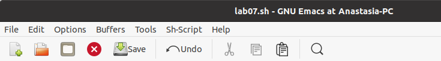

## Набрать текст

Наберу текст.

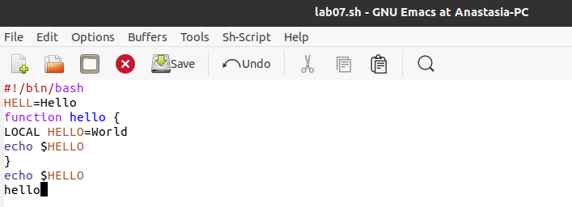

## Сохранить файл

Сохраню файл с помощью комбинации Ctrl-x Ctrl-s.

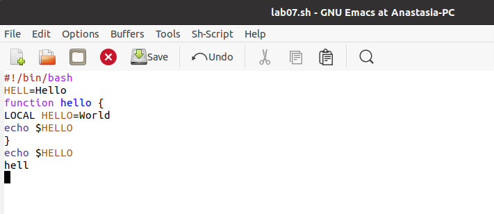

## Проделаю с текстом стандартные процедуры редактирования, каждое действие должно осуществляться комбинацией клавиш

## Вырежу одной командой целую строку

Вырежу одной командой целую строку (С-k).

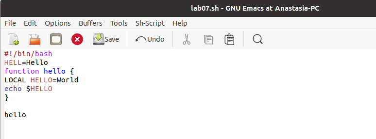

## Вставлю эту строку в конец файла

Вставлю эту строку в конец файла (C-y).

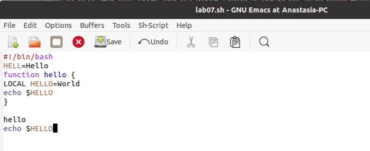

## Выделю область текста

Выделю область текста (C-space).

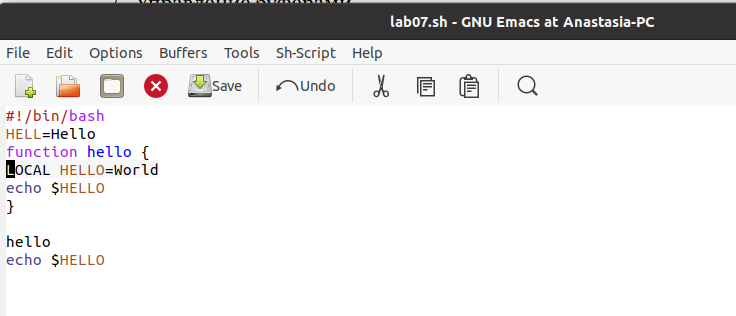

## Скопирую область в буфер обмена

Скопирую область в буфер обмена (M-w).

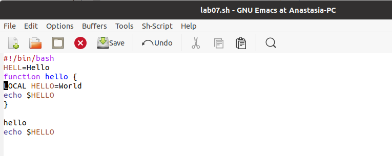

## Вставлю область в конец файла

Вставлю область в конец файла.

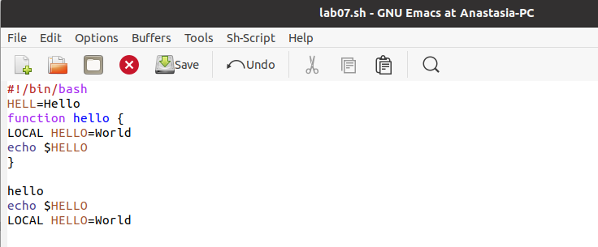

## Вновь выделю эту область и вырежу её

Вновь выделю эту область и на этот раз вырежу её (C-w).

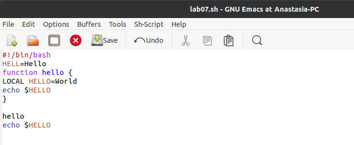

## Отменю последнее действие

Отменю последнее действие (C-/).

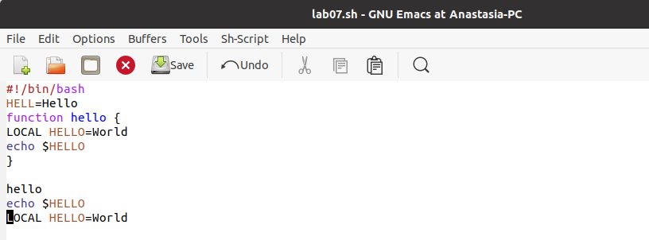

## Научусь использовать команды по перемещению курсора.

## Перемещу курсор в начало строки

Перемещу курсор в начало строки (C-a).

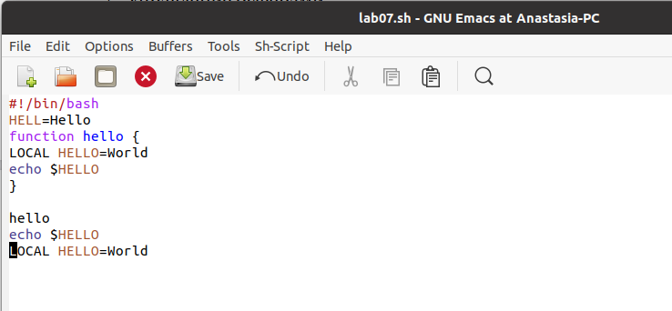

## Перемещу курсор в конец строки

Перемещу курсор в конец строки (C-e).

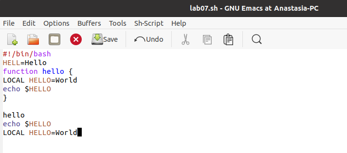

## Перемещу курсор в начало буфера

Перемещу курсор в начало буфера (M-<).

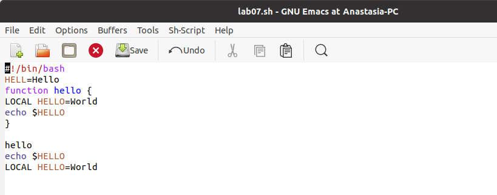

## Перемещу курсор в конец буфера

Перемещу курсор в конец буфера (M->).

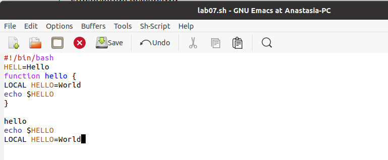

## Управление буферами.

## Выведу список активных буферов на экран

Выведу список активных буферов на экран (C-x C-b).

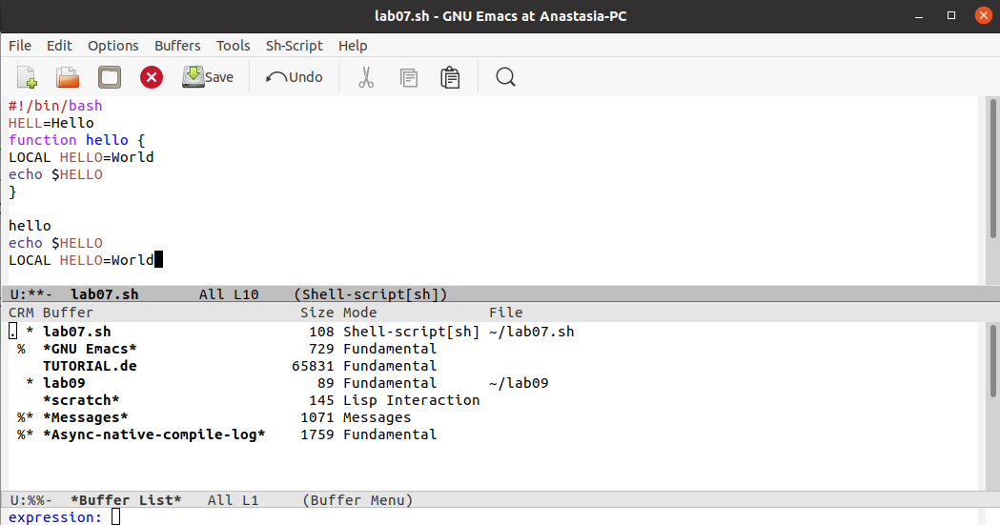

## Перемещусь во вновь открытое окно и переключусь на другой буфер

Перемещусь во вновь открытое окно (C-x) o со списком открытых буферов и переключусь на другой буфер (C-x C-b).

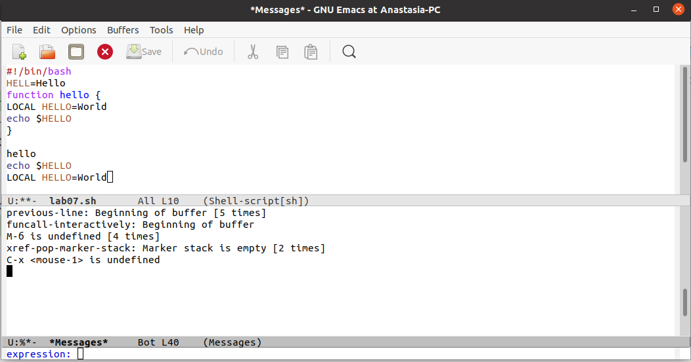

## Закрою это окно

Закрою это окно (C-x 0).

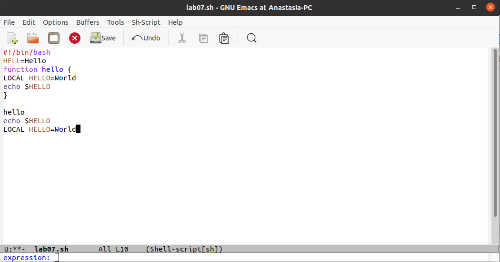

## Теперь вновь переключусь между буферами

Теперь вновь переключусь между буферами, но уже без вывода их списка на экран (C-x b).

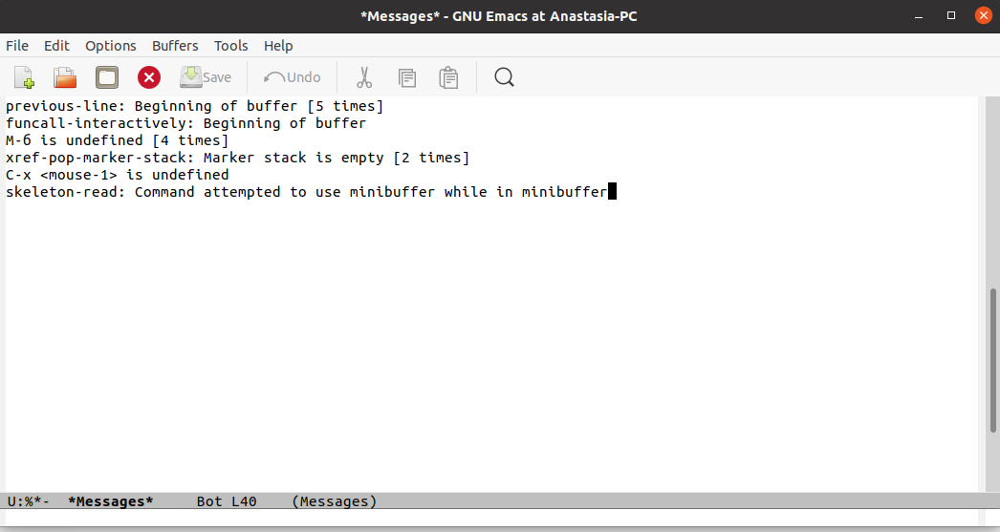

## Управление окнами

## Поделю фрейм на 4 части

Поделю фрейм на 4 части: разделю фрейм на два окна по вертикали (C-x 3), а затем каждое из этих окон на две части по горизонтали (C-x 2).

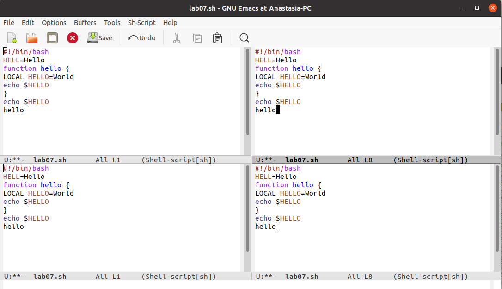

## В каждом из окон открою новый буфер

В каждом из четырёх созданных окон открою новый буфер (файл) и введу несколько строк текста.

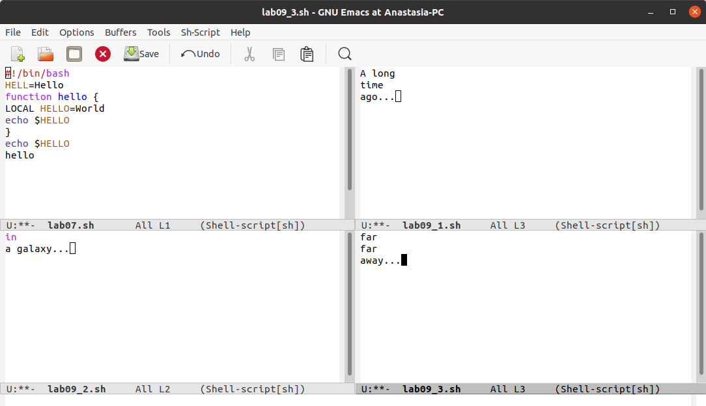

## Переключусь в режим поиска и найду несколько слов

Переключусь в режим поиска (C-s) и найду несколько слов, присутствующих в тексте.

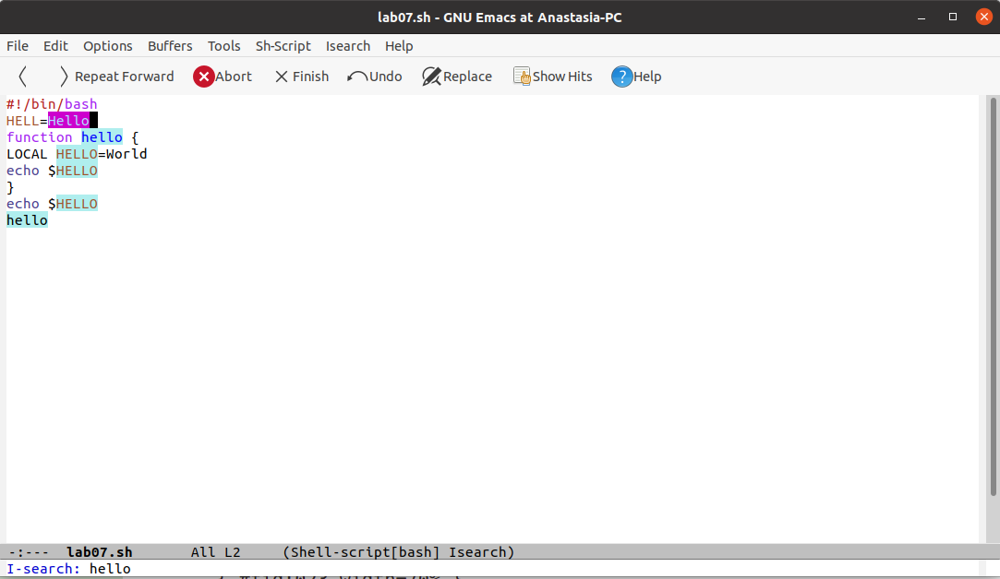

## Переключаюсь между результатами поиска

Переключаюсь между результатами поиска, нажимая C-s.

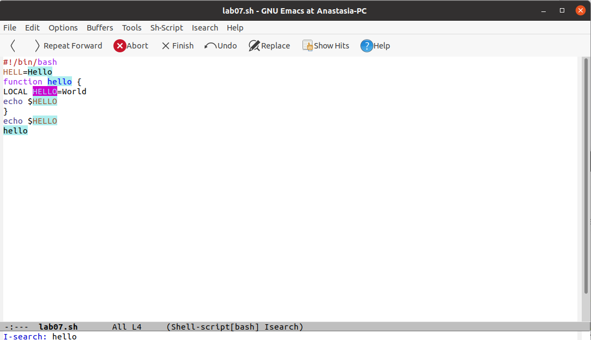

## Выйду из режима поиска

Выйду из режима поиска, нажав C-g.

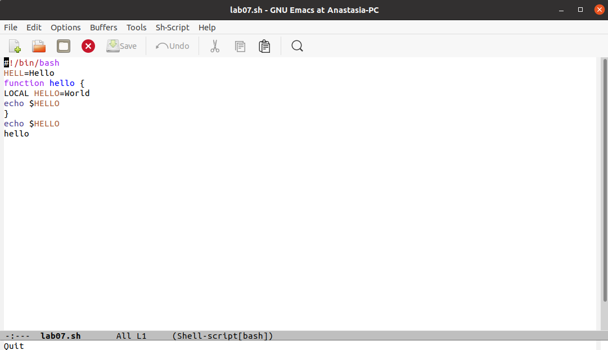

## Перейду в режим поиска и замены, введу текст

Перейду в режим поиска и замены (M-%), введу текст, который следует найти и заменить, нажму Enter , затем введу текст для замены. После того как будут подсвечены результаты поиска, нажму ! для подтверждения замены.

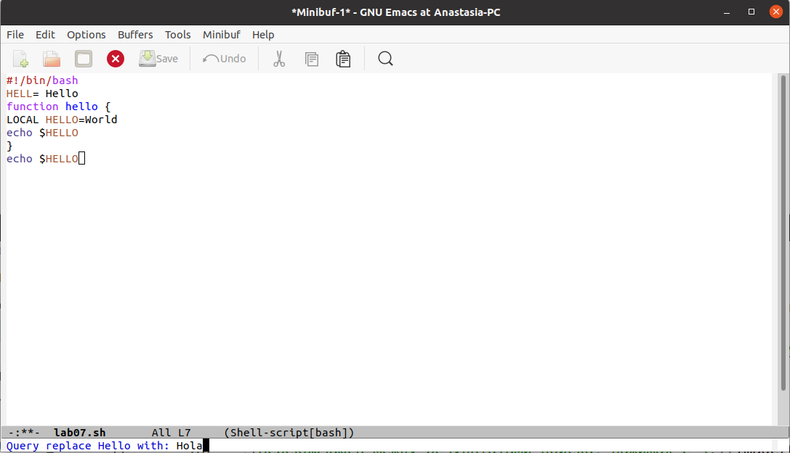

## После того как будут подсвечены результаты поиска, нажму ! для подтверждения замены

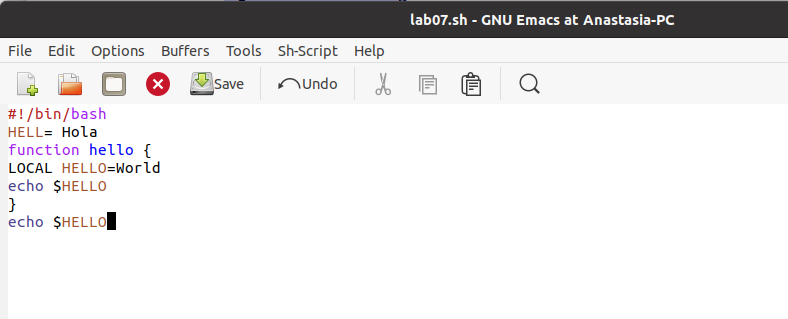

## Выйду из режима поиска, нажав C-g

Испробую другой режим поиска, нажав M-s o. Он отличается от обычного режима тем, что при поиске указывает номера строк, в которых найдено введённое слово, и выделяет их цветом. В обычном режиме веделение цветом появляется только когда нужно подтвердить замену.

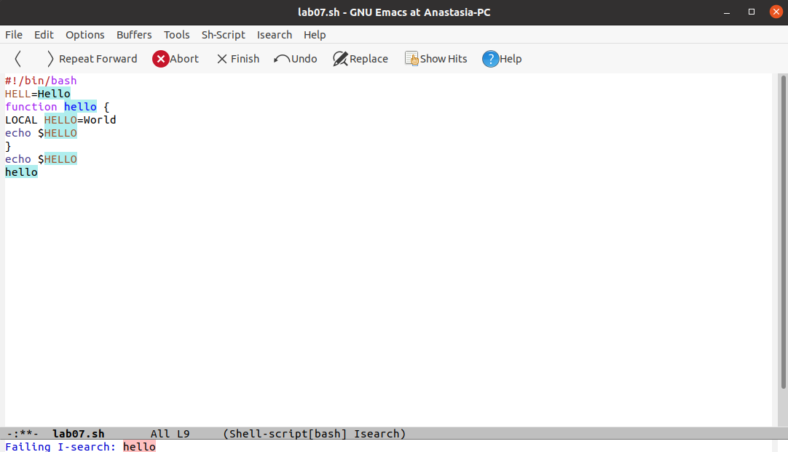

## Вывод

В ходе выполнения данной лабораторной работы я познакомилась с операционной системой Linux и получила практические навыки работы с редактором Emacs.