---
## Front matter
title: "ОТЧЕТ ПО ЛАБОРАТОРНОЙ РАБОТЕ №9"
subtitle: "Простейший вариант"
author: "Анастасия Павловна Баранова, НБИбд-01-21"

## Generic otions
lang: ru-RU
toc-title: "Содержание"

## Bibliography
bibliography: bib/cite.bib
csl: pandoc/csl/gost-r-7-0-5-2008-numeric.csl

## Pdf output format
toc: true # Table of contents
toc-depth: 2
lof: true # List of figures
#lot: true # List of tables
fontsize: 12pt
linestretch: 1.5
papersize: a4
documentclass: scrreprt
## I18n polyglossia
polyglossia-lang:
  name: russian
  options:
	- spelling=modern
	- babelshorthands=true
polyglossia-otherlangs:
  name: english
## I18n babel
babel-lang: russian
babel-otherlangs: english
## Fonts
mainfont: PT Serif
romanfont: PT Serif
sansfont: PT Sans
monofont: PT Mono
mainfontoptions: Ligatures=TeX
romanfontoptions: Ligatures=TeX
sansfontoptions: Ligatures=TeX,Scale=MatchLowercase
monofontoptions: Scale=MatchLowercase,Scale=0.9
## Biblatex
biblatex: true
biblio-style: "gost-numeric"
biblatexoptions:
  - parentracker=true
  - backend=biber
  - hyperref=auto
  - language=auto
  - autolang=other*
  - citestyle=gost-numeric
## Pandoc-crossref LaTeX customization
figureTitle: "Рис."
#tableTitle: "Таблица"
listingTitle: "Листинг"
lofTitle: "Список иллюстраций"
#lotTitle: "Список таблиц"
lolTitle: "Листинги"
## Misc options
indent: true
header-includes:
  - \usepackage{indentfirst}
  - \usepackage{float} # keep figures where there are in the text
  - \floatplacement{figure}{H} # keep figures where there are in the text
---

# Цель работы

Целью данной работы является знакомство с операционной системой Linux и получение практических навыков работы с редактором Emacs.

# Задание

1. Ознакомиться с теоретическим материалом.
2. Ознакомиться с редактором emacs.
3. Выполнить упражнения.
4. Ответить на контрольные вопросы.

# Выполнение лабораторной работы

Открою emacs. (рис. [-@fig:001])

{ #fig:001 width=70% }

Создам файл lab07.sh с помощью комбинации Ctrl-x Ctrl-f. (рис. [-@fig:002])

{ #fig:002 width=70% }

Наберу текст. (рис. [-@fig:003])

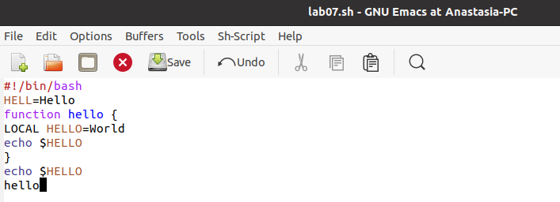{ #fig:003 width=70% }

Сохраню файл с помощью комбинации Ctrl-x Ctrl-s. (рис. [-@fig:004])

{ #fig:004 width=70% }

Проделаю с текстом стандартные процедуры редактирования, каждое действие должно осуществляться комбинацией клавиш.

- Вырежу одной командой целую строку (С-k). (рис. [-@fig:005])

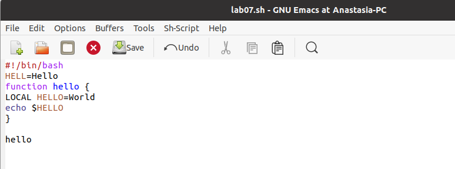{ #fig:005 width=70% }

- Вставлю эту строку в конец файла (C-y). (рис. [-@fig:006])

{ #fig:006 width=70% }

- Выделю область текста (C-space). (рис. [-@fig:007])

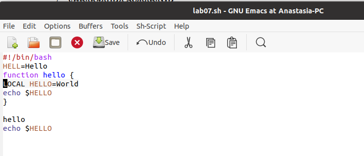{ #fig:007 width=70% }

- Скопирую область в буфер обмена (M-w). (рис. [-@fig:008])

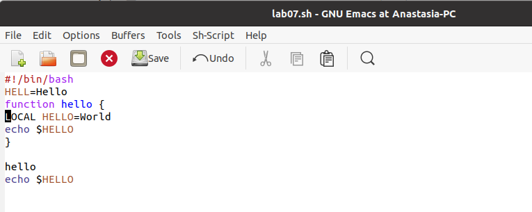{ #fig:008 width=70% }

- Вставлю область в конец файла. (рис. [-@fig:009])

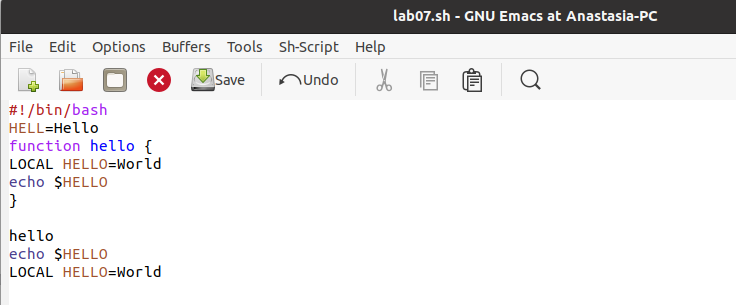{ #fig:009 width=70% }

- Вновь выделю эту область и на этот раз вырежу её (C-w). (рис. [-@fig:010])

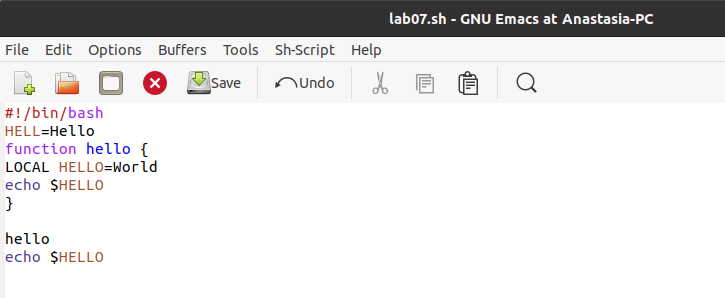{ #fig:010 width=70% }

- Отменю последнее действие (C-/). (рис. [-@fig:011])

{ #fig:011 width=70% }

Научусь использовать команды по перемещению курсора.

- Перемещу курсор в начало строки (C-a). (рис. [-@fig:012])

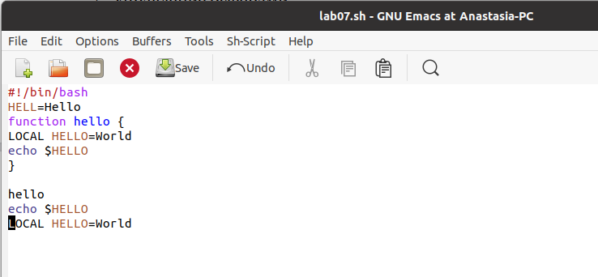{ #fig:012 width=70% }

- Перемещу курсор в конец строки (C-e). (рис. [-@fig:013])

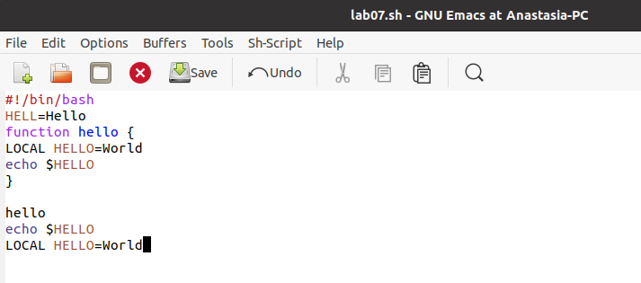{ #fig:013 width=70% }

- Перемещу курсор в начало буфера (M-<). (рис. [-@fig:014])

{ #fig:014 width=70% }

- Перемещу курсор в конец буфера (M->). (рис. [-@fig:015])

{ #fig:015 width=70% }

Управление буферами.

- Выведу список активных буферов на экран (C-x C-b). (рис. [-@fig:016])

{ #fig:016 width=70% }

- Перемещусь во вновь открытое окно (C-x) o со списком открытых буферов и переключусь на другой буфер. (рис. [-@fig:017])

{ #fig:017 width=70% }

- Закрою это окно (C-x 0). (рис. [-@fig:018])

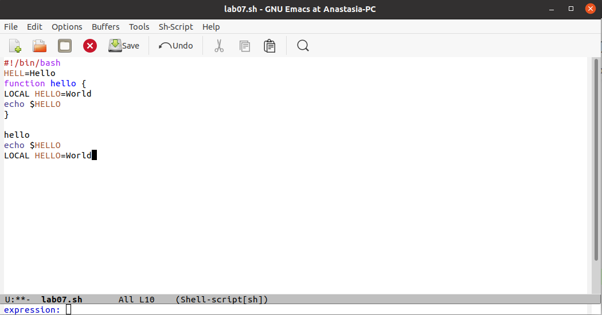{ #fig:018 width=70% }

- Теперь вновь переключусь между буферами, но уже без вывода их списка на экран (C-x b). (рис. [-@fig:019])

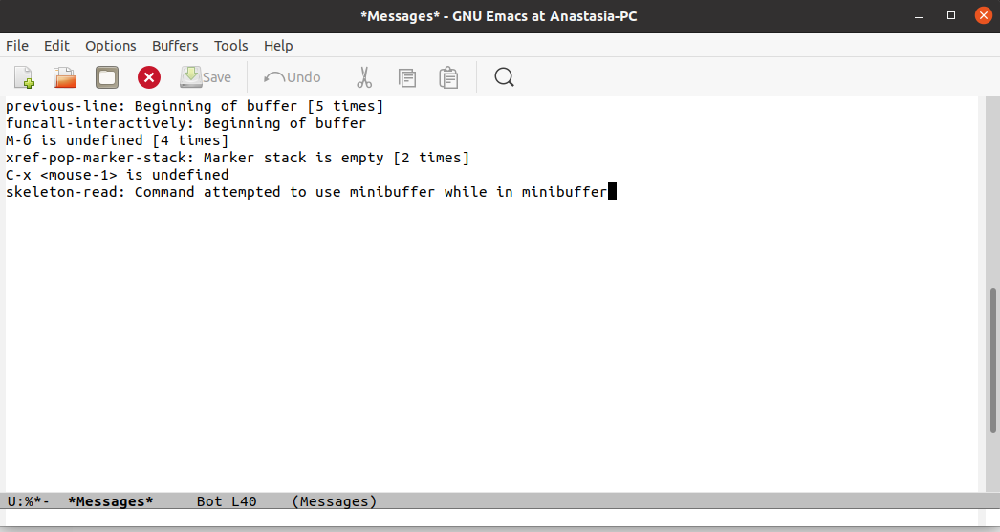{ #fig:019 width=70% }

Управление окнами.

- Поделю фрейм на 4 части: разделю фрейм на два окна по вертикали (C-x 3), а затем каждое из этих окон на две части по горизонтали (C-x 2). (рис. [-@fig:020])

{ #fig:020 width=70% }

- В каждом из четырёх созданных окон открою новый буфер (файл) и введу несколько строк текста. (рис. [-@fig:021])

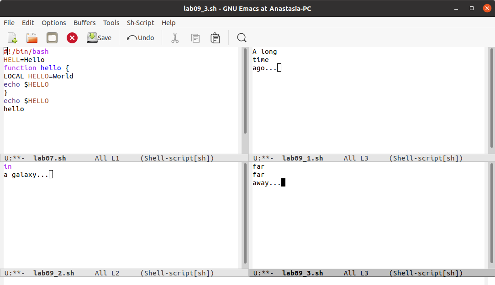{ #fig:021 width=70% }

Режим поиска.

- Переключусь в режим поиска (C-s) и найду несколько слов, присутствующих в тексте. (рис. [-@fig:022])

{ #fig:022 width=70% }

- Переключаюсь между результатами поиска, нажимая C-s. (рис. [-@fig:023])

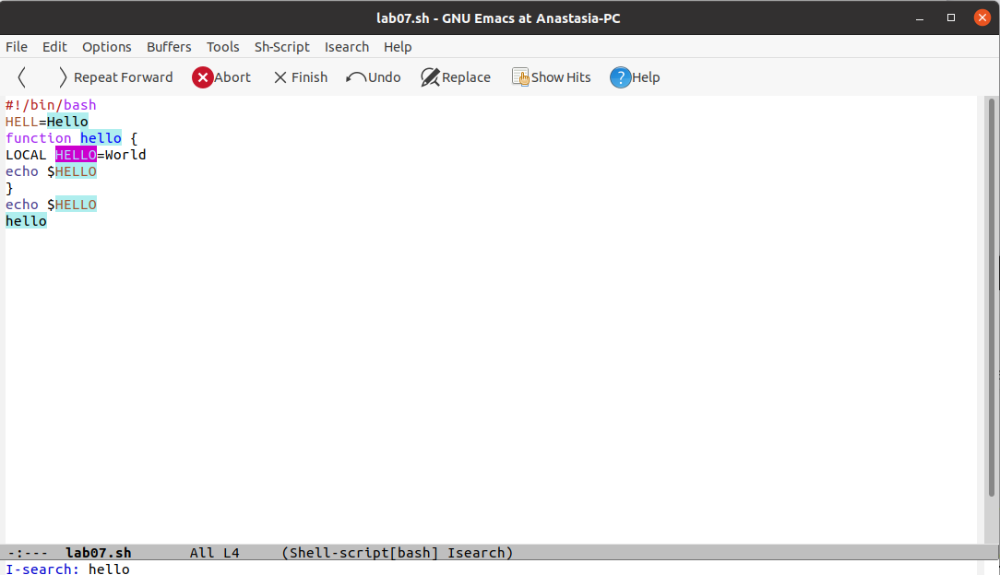{ #fig:023 width=70% }

- Выйду из режима поиска, нажав C-g. (рис. [-@fig:024])

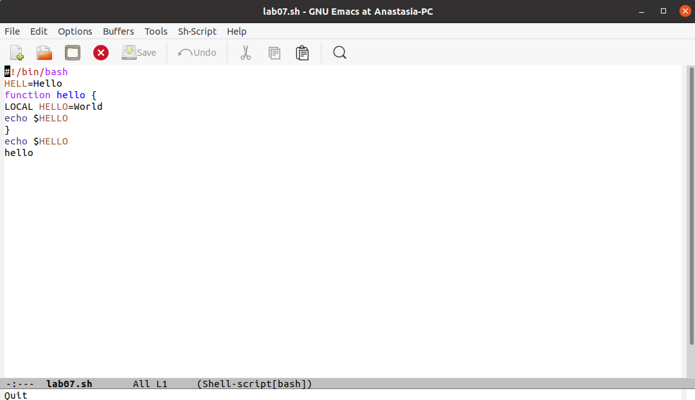{ #fig:024 width=70% }

- Перейду в режим поиска и замены (M-%), введу текст, который следует найти и заменить, нажму Enter , затем введу текст для замены. После того как будут подсвечены результаты поиска, нажму ! для подтверждения замены. (рис. [-@fig:025], рис. [-@fig:026])

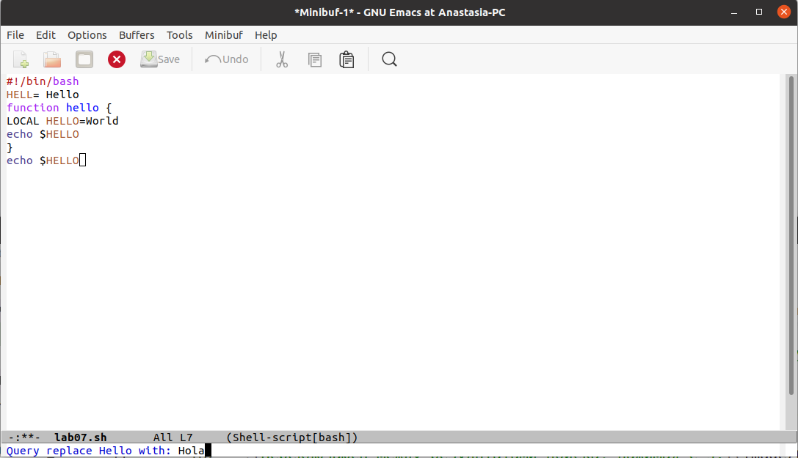{ #fig:025 width=70% }

{ #fig:026 width=70% }

- Испробую другой режим поиска, нажав M-s o. (рис. [-@fig:027]) Он отличается от обычного режима тем, что при поиске указывает номера строк, в которых найдено введённое слово, и выделяет их цветом. В обычном режиме веделение цветом появляется только когда нужно подтвердить замену.

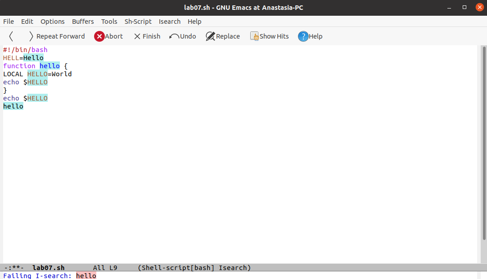{ #fig:027 width=70% }

# Вывод

В ходе выполнения данной лабораторной работы я познакомилась с операционной системой Linux и получила практические навыки работы с редактором Emacs.

# Конторльные вопросы

1. Кратко охарактеризуйте редактор emacs.

  Ответ: Emacs представляет собой мощный экранный редактор текста, написанный на языке высокого уровня Elisp.

2. Какие особенности данного редактора могутсделать его сложным для освоения новичком?

  Ответ: Развитие Emacs в сторону его многогранности послужило причиной того, что и без того интуитивно непонятная программа стала чрезвычайно сложной в применении. В частности, управление осуществляется при помощи различных клавиатурных комбинаций, запомнить которые будет непросто.

3. Своими словами опишите,чтотакое буфер и окно втерминологии emacs’а.

  Ответ: Буфер – что-то, состоящее из текста. Окно – область с одним из буферов.

4. Можно ли открыть больше 10 буферов в одном окне?

  Ответ: В одном окне можно открыть больше 10 буферов.

5. Какие буферы создаются по умолчанию при запуске emacs?

  Ответ: После запуска emacs без каких-либо параметров в основном окне отображается буфер scratch, который используется для оценки выражений Emacs Lisp, а также для заметок, которые вы не хотите сохранять. Этот буфер не сохраняется автоматически.

6. Какие клавиши вы нажмёте,чтобы ввести следующую комбинацию C-c | и C-c C-|?

  Ответ: Чтобы ввести следующую комбинацию C-c | я нажму клавиши: Control+c и Shift+, и для C-c C-|: Control+c и Control+Shift+.

7. Как поделить текущее окно на две части?

  Ответ: Поделить текущее окно на две части можно двумя комбинациями клавиш: C-x 3 или C-x 2.

8. В каком файле хранятся настройки редактора emacs?

  Ответ: Настроить или расширить Emacs можно написав или изменив файл ~/.emacs.

9. Какую функцию выполняет клавиша ← и можно ли её переназначить?

  Ответ: Клавиша ← выполняет функцию перемещения курсора в открытом окне также, как и многие другие клавиши её можно переназначить.

10. Какой редактор вам показался удобнее в работе vi или emacs? Поясните почему.

  Ответ: Редактор emacs показался мне удобнее из-за возможности открытия нескольких окон с буферами и работать комбинациями клавиш в этот редакторе мне было проще.