---
## Front matter
lang: ru-RU
title: Лабораторная работа No 10
author: |
	Анастасия Павловна Баранова, НБИбд-01-21\inst{1}
institute: |
	\inst{1}Российский Университет Дружбы Народов
date: 19 мая, Москва, 2022 г

## Formatting
toc: false
slide_level: 2
theme: metropolis
header-includes: 
 - \metroset{progressbar=frametitle,sectionpage=progressbar,numbering=fraction}
 - '\makeatletter'
 - '\beamer@ignorenonframefalse'
 - '\makeatother'
aspectratio: 43
section-titles: true
---

## Цель лабораторной работы

Целью данной работы является изучить основы программирования в оболочке ОС UNIX/Linux и научиться писать небольшие командные файлы.

# Выполнение лабораторной работы

## Напишу скрипт

Напишу скрипт, который при запуске будет делать резервную копию самого себя (то есть файла, в котором содержится его исходный код) в другую директорию backup в вашем домашнем каталоге. При этом файл должен архивироваться одним из архиваторов на выбор zip, bzip2 или tar. Способ использования команд архивации узнаю, изучив справку.

## Способ использования команд архивации

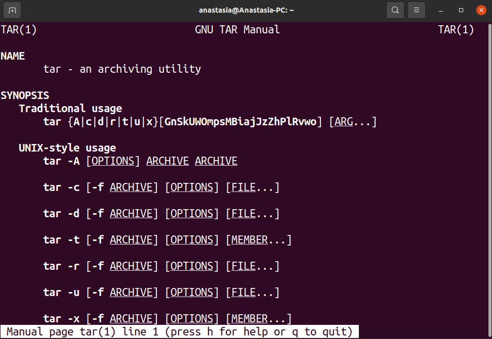

## Создам файл script.sh

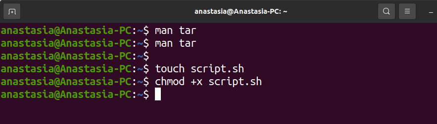

## Напишу скрипт

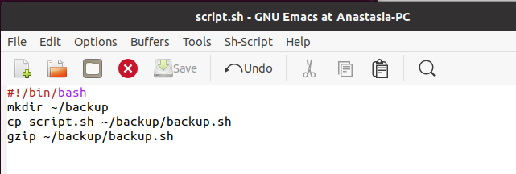#

## Всё получилось

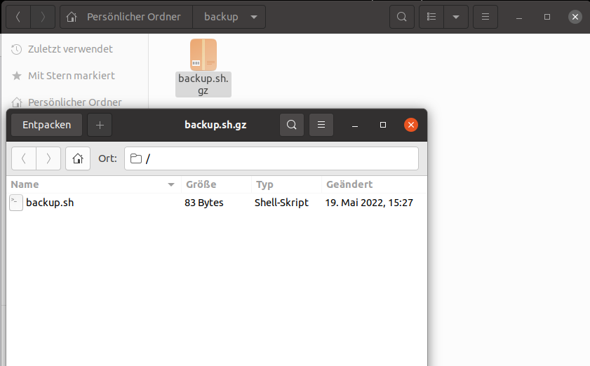

## Напишу пример командного файла

Напишу пример командного файла, обрабатывающего любое произвольное число аргументов командной строки, в том числе превышающее десять. Например, скрипт может последовательно распечатывать значения всех переданных аргументов.

## Напишу пример командного файла

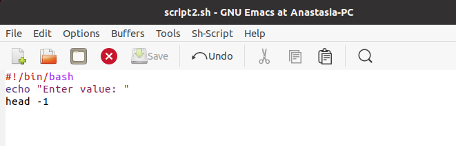

## Всё получилось.

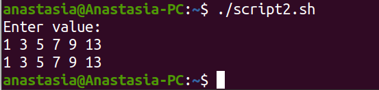

## Напишу командный файл

Напишу командный файл — аналог команды ls (без использования самой этой команды и команды dir). Требуется, чтобы он выдавал информацию о нужном каталоге и выводил информацию о возможностях доступа к файлам этого каталога.

## Напишу командный файл

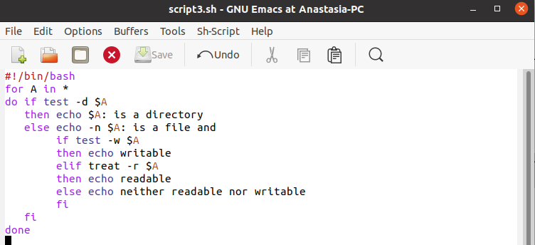

## Всё получилось

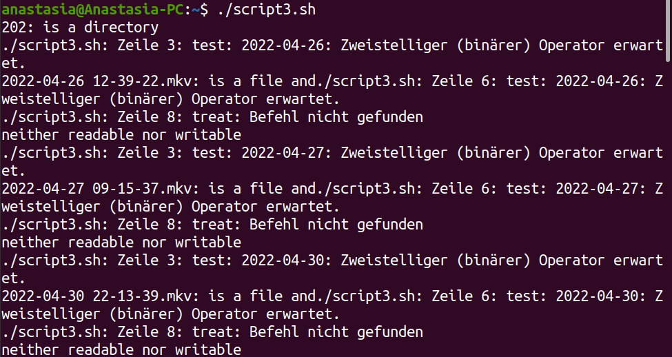

## Напишу командный файл

Напишу командный файл, который получает в качестве аргумента командной строки формат файла (.txt, .doc, .jpg, .pdf и т.д.) и вычисляет количество таких файлов в указанной директории. Путь к директории также передаётся в виде аргумента командной строки.

## Напишу командный файл

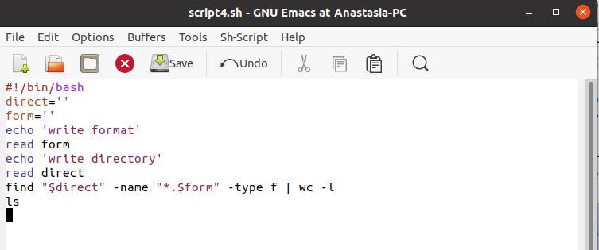

## Всё получилось

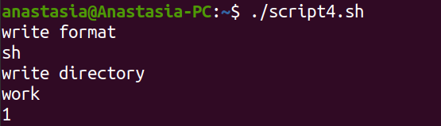

## Всё получилось

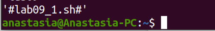

## Вывод

В ходе данной лабораторной работы я изучила основы программирования в оболочке ОС UNIX/Linux, научилась писать небольшие командные файлы.
