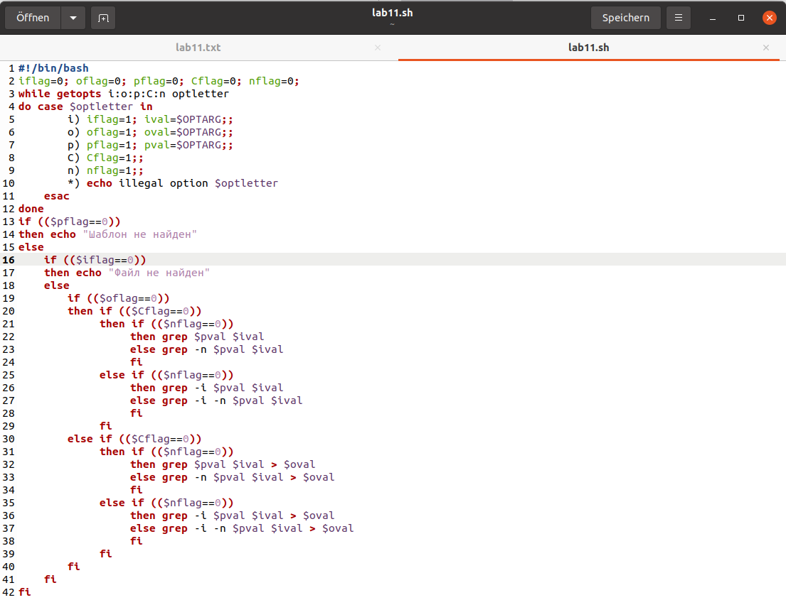
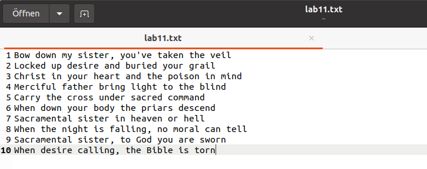
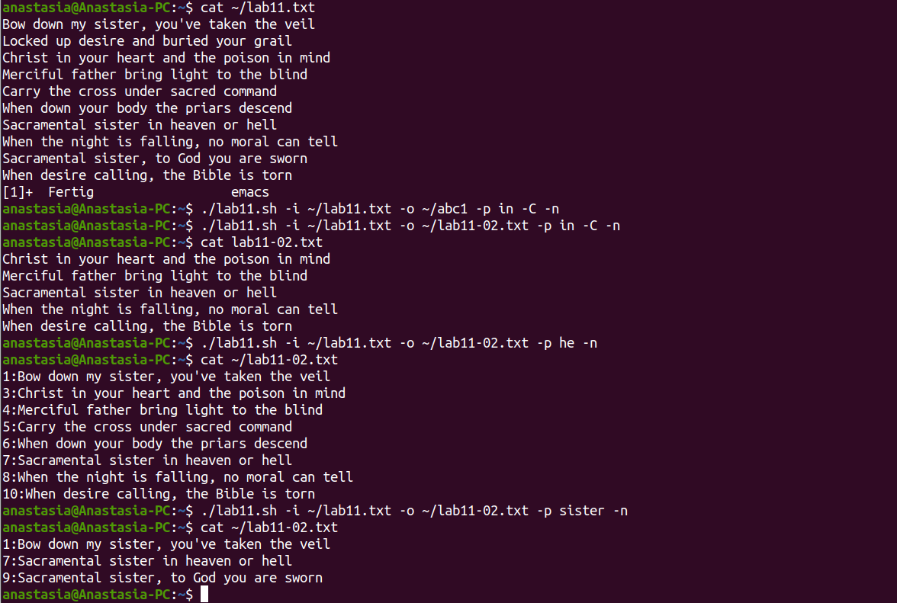
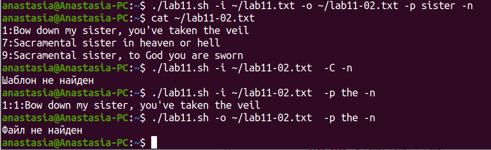
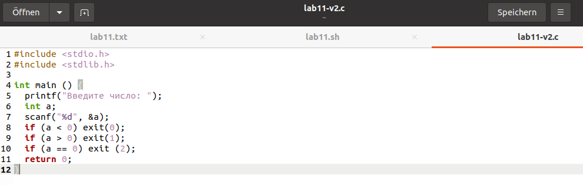
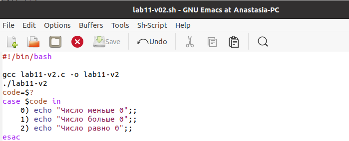
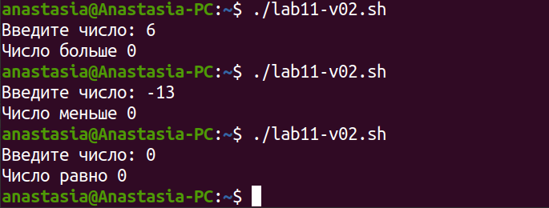
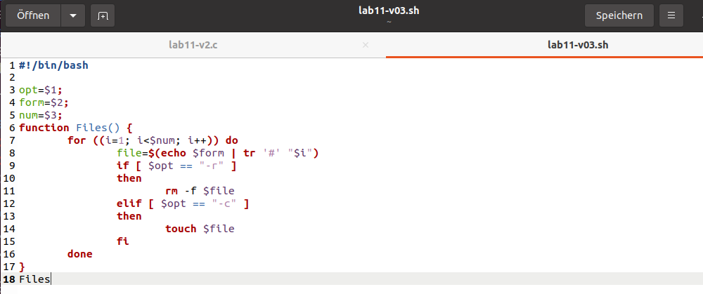
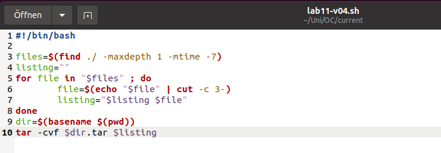
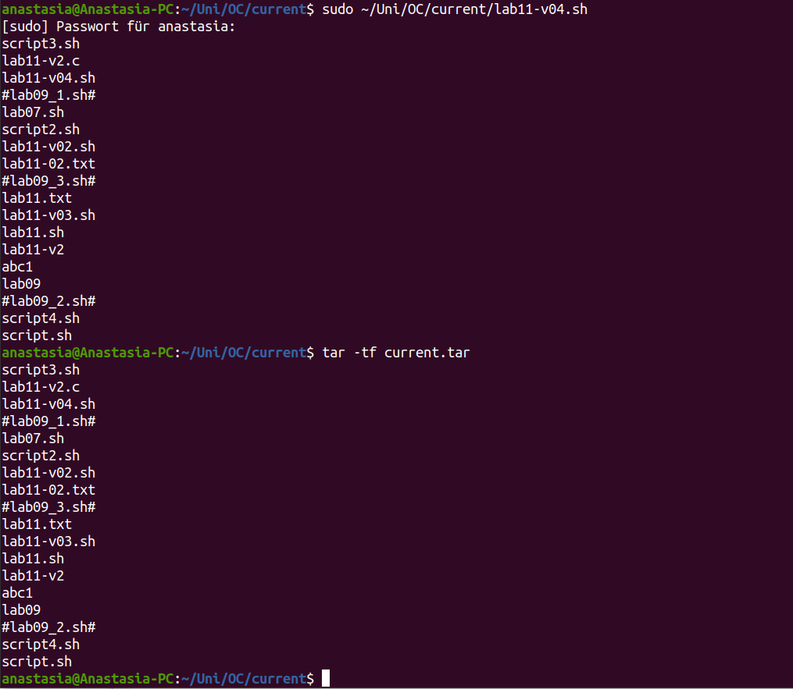

---
## Front matter
lang: ru-RU
title: Лабораторная работа No 11
author: |
	Анастасия Павловна Баранова, НБИбд-01-21\inst{1}
institute: |
	\inst{1}Российский Университет Дружбы Народов
date: 23 мая, Москва, 2022 г

## Formatting
toc: false
slide_level: 2
theme: metropolis
header-includes: 
 - \metroset{progressbar=frametitle,sectionpage=progressbar,numbering=fraction}
 - '\makeatletter'
 - '\beamer@ignorenonframefalse'
 - '\makeatother'
aspectratio: 43
section-titles: true
---

## Цель лабораторной работы

Целью данной работы является изучить основы программирования в оболочке ОС UNIX и научиться писать более сложные командные файлы с использованием логических управляющих конструкций и циклов.

# Выполнение лабораторной работы

## Напишу командный файл

Используя команды getopts grep, напишу командный файл, который анализирует
командную строку с ключами:
– -iinputfile — прочитать данные из указанного файла;
– -ooutputfile — вывести данные в указанный файл;
– -pшаблон — указать шаблон для поиска;
– -C — различать большие и малые буквы;
– -n — выдавать номера строк.
а затем ищет в указанном файле нужные строки, определяемые ключом -p.

## Напишу командный файл

## Указанный файл с текстом

## Демонстрирую работу командного файла

## Демонстрирую работу командного файла

## Напишу на языке Си программу

Напишу на языке Си программу, которая вводит число и определяет, является ли оно больше нуля, меньше нуля или равно нулю. Затем программа завершается с помощью функции exit(n), передавая информацию в о коде завершения в оболочку. Командный файл должен вызывать эту программу и, проанализировав с помощью команды $?, выдать сообщение о том, какое число было введено.

## Напишу на языке Си программу

## Напишу командный файл

## Демонстрирую работу командного файла

## Напишу командный файл

Напишу командный файл, создающий указанное число файлов, пронумерованных последовательно от 1 до N (например 1.tmp, 2.tmp, 3.tmp,4.tmp и т.д.). Число файлов, которые необходимо создать, передаётся в аргументы командной строки. Этот же командный файл должен уметь удалять все созданные им файлы (если они существуют).

## Напишу командный файл

## Демонстрирую работу командного файла

## Демонстрирую работу командного файла

## Демонстрирую работу командного файла

## Напишу командный файл

Напишу командный файл, который с помощью команды tar запаковывает в архив
все файлы в указанной директории. Модифицирую его так, чтобы запаковывались
только те файлы, которые были изменены менее недели тому назад (использую
команду find).

## Напишу командный файл

## Демонстрирую работу командного файла

## Вывод

В ходе данной лабораторной работы я изучила основы программирования в оболочке ОС UNIX/Linux, научилась писать более сложные командные файлы с использованием логических управляющих конструкций и циклов.