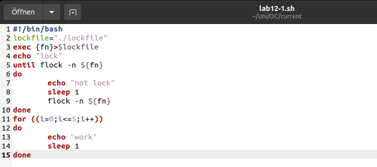
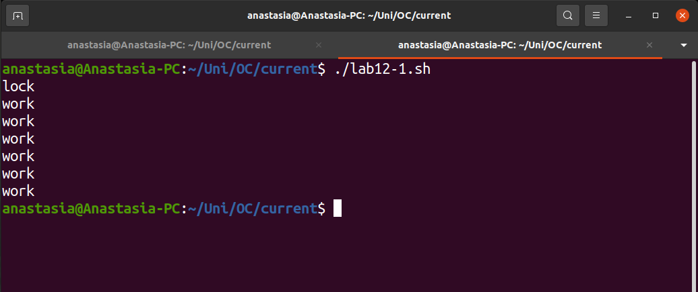
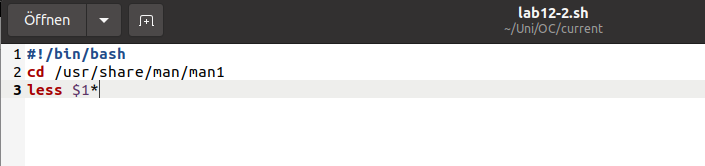
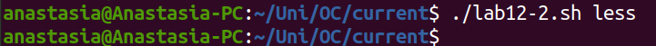
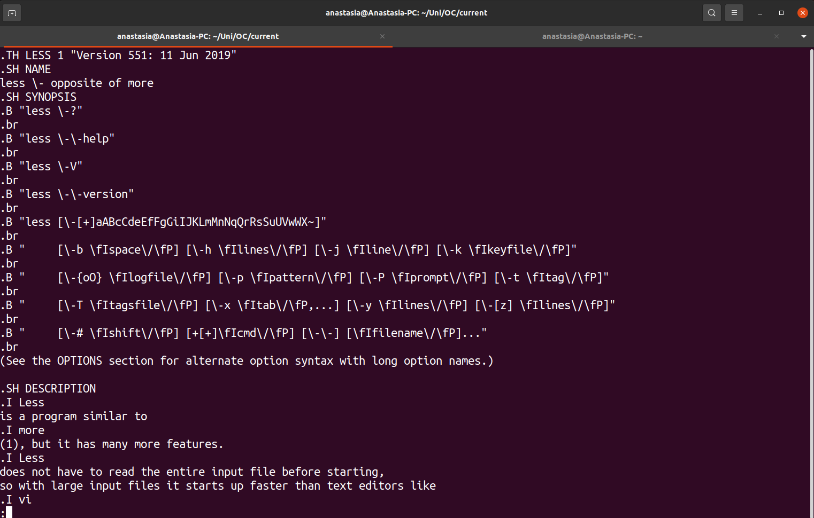
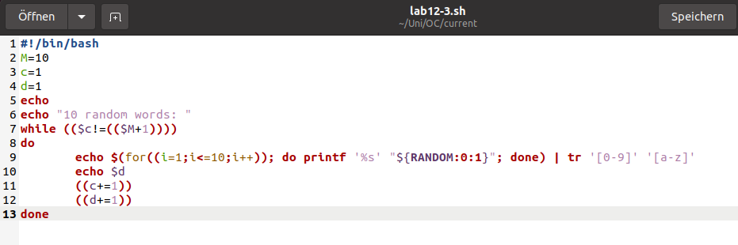
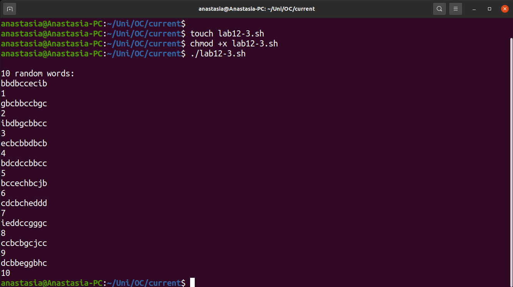

---
## Front matter
lang: ru-RU
title: Лабораторная работа No 12
author: |
	Анастасия Павловна Баранова, НБИбд-01-21\inst{1}
institute: |
	\inst{1}Российский Университет Дружбы Народов
date: 24 мая, Москва, 2022 г

## Formatting
toc: false
slide_level: 2
theme: metropolis
header-includes: 
 - \metroset{progressbar=frametitle,sectionpage=progressbar,numbering=fraction}
 - '\makeatletter'
 - '\beamer@ignorenonframefalse'
 - '\makeatother'
aspectratio: 43
section-titles: true
---

## Цель лабораторной работы

Целью данной лабораторной работы является изучить основы программирования в оболочке ОС UNIX и научиться писать более сложные командные файлы с использованием логических управляющих конструкций и циклов.

# Выполнение лабораторной работы

## Напишу командный файл

Напишу командный файл, реализующий упрощённый механизм семафоров. Командный файл должен в течение некоторого времени t1 дожидаться освобождения ресурса, выдавая об этом сообщение, а дождавшись его освобождения, использовать его в течение некоторого времени t2<>t1, также выдавая информацию о том, что ресурс используется соответствующим командным файлом (процессом). Запущу командный файл в одном виртуальном терминале в фоновом режиме, перенаправив его вывод в другой (> /dev/tty#, где # — номер терминала куда перенаправляется вывод), в котором также запущен этот файл, но не фоновом, а в привилегированном режиме. Доработаю программу так, чтобы имелась возможность взаимодействия трёх и более процессов.

## Напишу командный файл

## Демонстрирую работу командного файла

## Реализую команду man

Реализую команду man с помощью командного файла. Изучу содержимое каталога /usr/share/man/man1. В нем находятся архивы текстовых файлов, содержащих справку по большинству установленных в системе программ и команд. Каждый архив можно открыть командой less сразу же просмотрев содержимое справки. Командный файл должен получать в виде аргумента командной строки название команды и в виде результата выдавать справку об этой команде или сообщение об отсутствии справки, если соответствующего файла нет в каталоге man1.

## Напишу командный файл

## Демонстрирую работу командного файла

## Демонстрирую работу командного файла

## Напишу командный файл

Используя встроенную переменную $RANDOM, напишу командный файл, генерирующий случайную последовательность букв латинского алфавита. Учту, что $RANDOM выдаёт псевдослучайные числа в диапазоне от 0 до 32767.

## Напишу командный файл

## Демонстрирую работу командного файла

## Вывод

В ходе данной лабораторной работы я изучила основы программирования в оболочке ОС UNIX и научилась писать более сложные командные файлы с использованием логических управляющих конструкций и циклов.