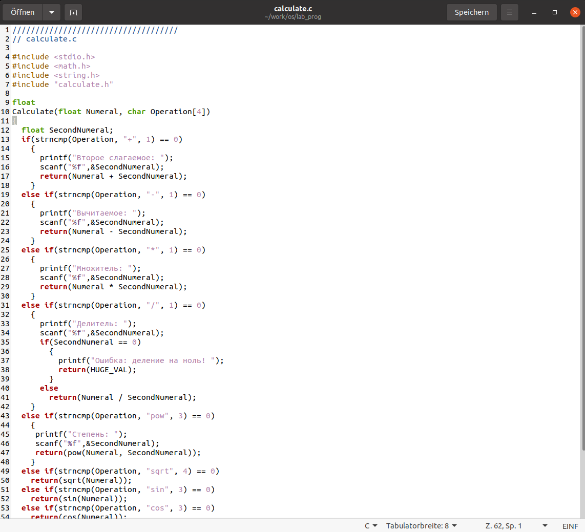
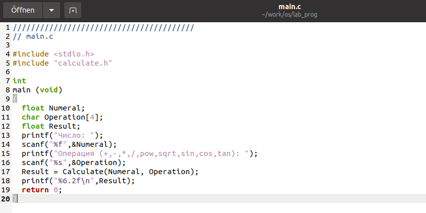
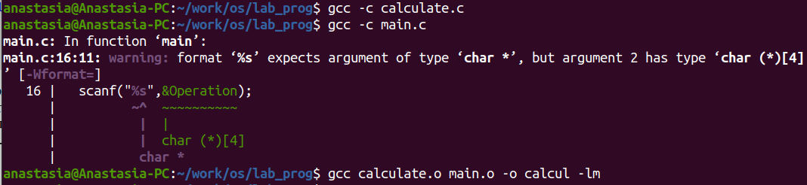
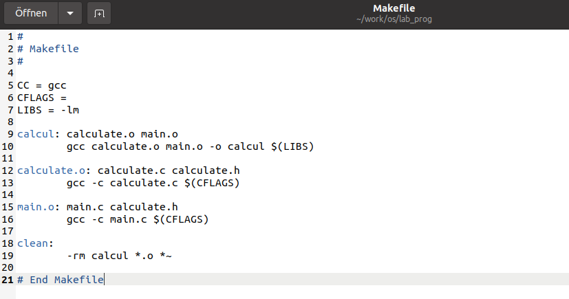
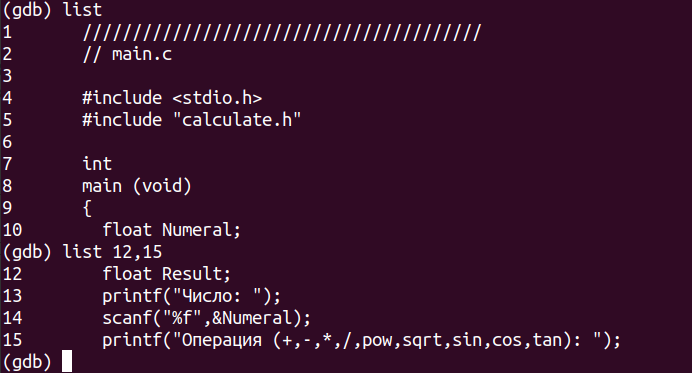
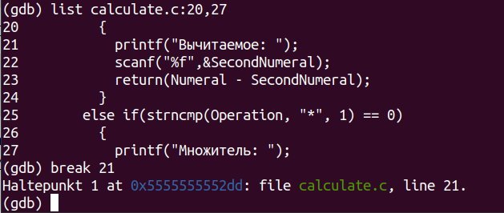
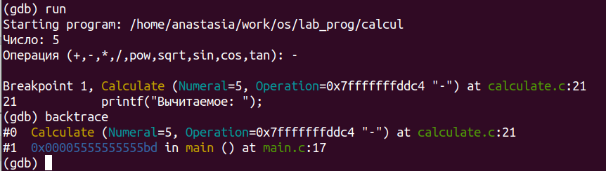
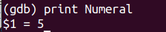
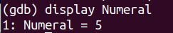
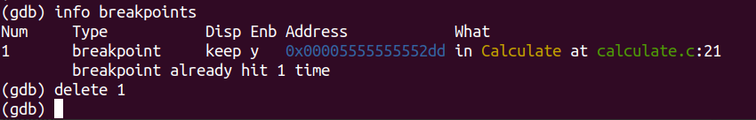

---
## Front matter
lang: ru-RU
title: Лабораторная работа No 13
author: |
	Анастасия Павловна Баранова, НБИбд-01-21\inst{1}
institute: |
	\inst{1}Российский Университет Дружбы Народов
date: 4 июня, Москва, 2022 г

## Formatting
toc: false
slide_level: 2
theme: metropolis
header-includes: 
 - \metroset{progressbar=frametitle,sectionpage=progressbar,numbering=fraction}
 - '\makeatletter'
 - '\beamer@ignorenonframefalse'
 - '\makeatother'
aspectratio: 43
section-titles: true
---

## Цель лабораторной работы

Целью данной лабораторной работы является приобрести простейшие навыки разработки, анализа, тестирования и отладки приложений в ОС типа UNIX/Linux на примере создания на языке программирования С калькулятора с простейшими функциями.

# Выполнение лабораторной работы

## В домашнем каталоге создам подкаталог ~/work/os/lab_prog.

## Создам в нём файлы: calculate.h, calculate.c, main.c.

Это будет примитивнейший калькулятор, способный складывать, вычитать, умножать и делить, возводить число в степень, брать квадратный корень, вычислять sin, cos, tan. При запуске он будет запрашивать первое число, операцию, второе число. После этого программа выведет результат и остановится.

## Создам в нём файлы: calculate.h, calculate.c, main.c.

## Реализация функций калькулятора в файле calculate.c

## Интерфейсный файл calculate.h, описывающий формат вызова функции-калькулятора

## Основной файл main.c, реализующий интерфейс пользователя к калькулятору

## Выполню компиляцию программы посредством gcc

## Создам Makefile со следующим содержанием

## В содержании файла указаны флаги компиляции, тип компилятора и файлы, которые должен собрать сборщик.

## С помощью gdb выполню отладку программы calcul (перед использованием gdb исправлю Makefile):

## Запущу отладчик GDB, загрузив в него программу для отладки: gdb ./calcul

## Перед использованием gdb исправлю Makefile

## Для запуска программы внутри отладчика введу команду run: run

## Для постраничного (по 9 строк) просмотра исходного кода использую команду list: list

## Для просмотра строк с 12 по 15 основного файла использую list с параметрами: list 12,15

## Для просмотра определённых строк не основного файла использую list с параметрами: list calculate.c:20,29

## Установлю точку останова в файле calculate.c на строке номер 21:

  list calculate.c:20,27
  break 21

## Установлю точку останова в файле calculate.c на строке номер 21

## Выведу информацию об имеющихся в проекте точках останова: info breakpoints

## Запущу программу внутри отладчика и проверю, что программа остановится в момент прохождения точки останова:
  
  run
  5
  -
  backtrace

## Запущу программу внутри отладчика и проверю, что программа остановится в момент прохождения точки останова

## Отладчик выдал следующую информацию:

  #0 Calculate (Numeral=5, Operation=0x7fffffffd280 "-")
  at calculate.c:21
  #1 0x0000000000400b2b in main () at main.c:17
  а команда backtrace показала весь стек вызываемых функций от начала программы до текущего места.

## Посмотрю, чему равно на этом этапе значение переменной Numeral, введя: print Numeral

  На экран было выведено число 5.

## Посмотрю, чему равно на этом этапе значение переменной Numeral, введя: print Numeral

## Сравню с результатом вывода на экран после использования команды: display Numeral

## Уберу точки останова:

  info breakpoints
  delete 1

## Уберу точки останова

## С помощью утилиты splint проанализирую коды файлов calculate.c и main.c

## С помощью утилиты splint проанализирую коды файлов calculate.c и main.c

## Вывод

В ходе данной лабораторной работы я приобрела простейшие навыки разработки, анализа, тестирования и отладки приложений в ОС типа UNIX/Linux на примере создания на языке программирования С калькулятора с простейшими функциями.