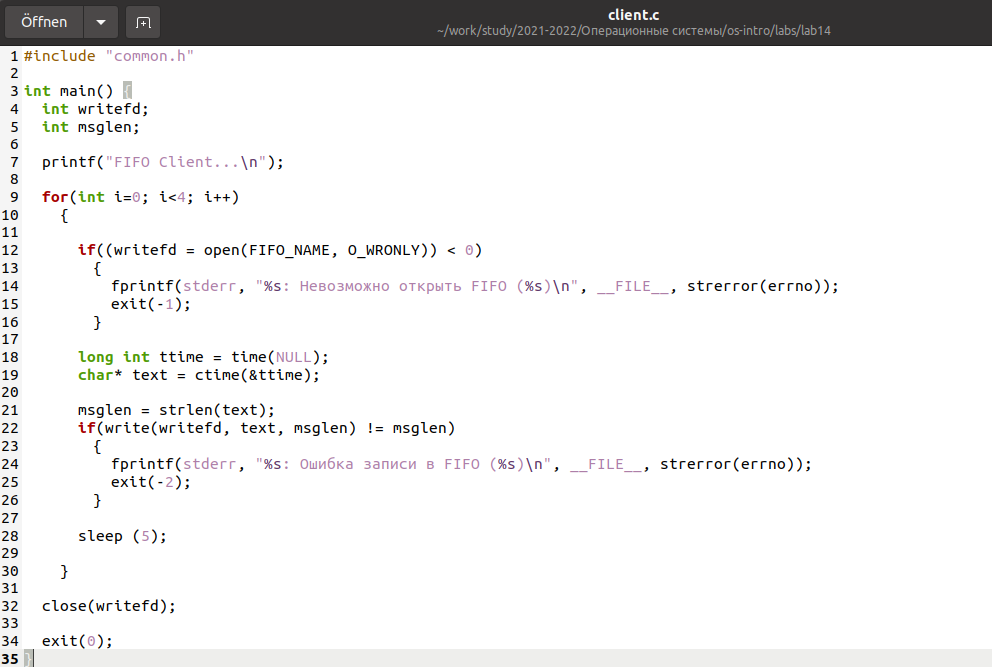
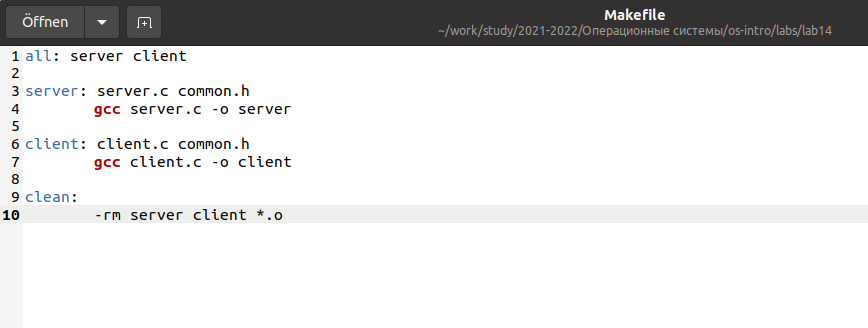

---
## Front matter
lang: ru-RU
title: Лабораторная работа No 14
author: |
	Анастасия Павловна Баранова, НБИбд-01-21\inst{1}
institute: |
	\inst{1}Российский Университет Дружбы Народов
date: 4 июня, Москва, 2022 г

## Formatting
toc: false
slide_level: 2
theme: metropolis
header-includes: 
 - \metroset{progressbar=frametitle,sectionpage=progressbar,numbering=fraction}
 - '\makeatletter'
 - '\beamer@ignorenonframefalse'
 - '\makeatother'
aspectratio: 43
section-titles: true
---

## Цель лабораторной работы

Целью данной лабораторной работы является приобретение практических навыков работы с именованными каналами.

# Выполнение лабораторной работы

## Создам необходимые файлы с помощью команды touch.

## Изменю коды программ

Изменю коды программ, представленных в тексте лабораторной работы. В файл common.h добавлю стандартные заголовочные файлы unistd.h и time.h, необходимые для работы кодов других файлов. Common.h предназначен для заголовочных файлов, чтобы в остальных программах их не прописывать каждый раз.

## Изменю коды программ

## В файл server.c добавлю цикл while

В файл server.c добавлю цикл while для контроля за временем работы сервера. Разница между текущим временем time(NULL) и временем начала работы clock_t start=time(NULL) (инициализация до цикла) не должна превышать 30 секунд.

## В файл server.c добавлю цикл while

## В файл client.c добавлю цикл

В файл client.c добавлю цикл, который отвечает за количество сообщений о текущем времени (4 сообщения), которое получается в результате выполнения команд, и команду sleep(5) для приостановки работы клиента на 5 секунд.

## В файл client.c добавлю цикл

## Makefile (файл для сборки) оставлю без изменений.

## Скомпилирую необходимые файлы, используя команду make all.

## Далее проверю работу написанного кода

Далее проверю работу написанного кода. Отрою 3 консоли (терминала) и запущу: в первом терминале − «./server», в остальных двух – «./client». В результате каждый терминал-клиент вывел по 4 сообщения. Спустя 30 секунд работа сервера была прекращена. Программа работает корректно.

## Отдельно проверю длительность работы сервера

Отдельно проверю длительность работы сервера, введя команду «./server» в одном терминале. Он завершил свою работу через 30 секунд. Если сервер завершит свою работу, не закрыв канал, то, когда мы будем запускать этот сервер снова, появится ошибка «Невозможно создать FIFO», так как у нас уже есть один канал.

## Вывод

В ходе данной лабораторной работы я приобрела практические навыки работы с именованными каналами.