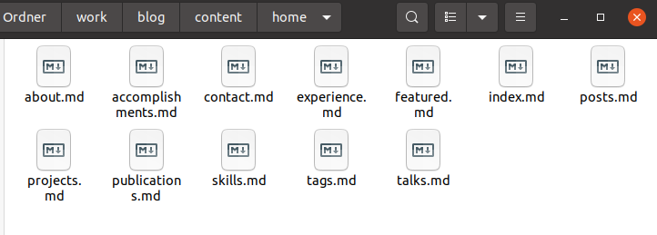
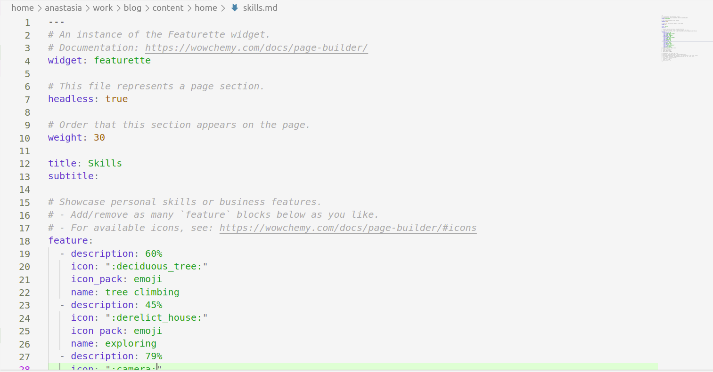
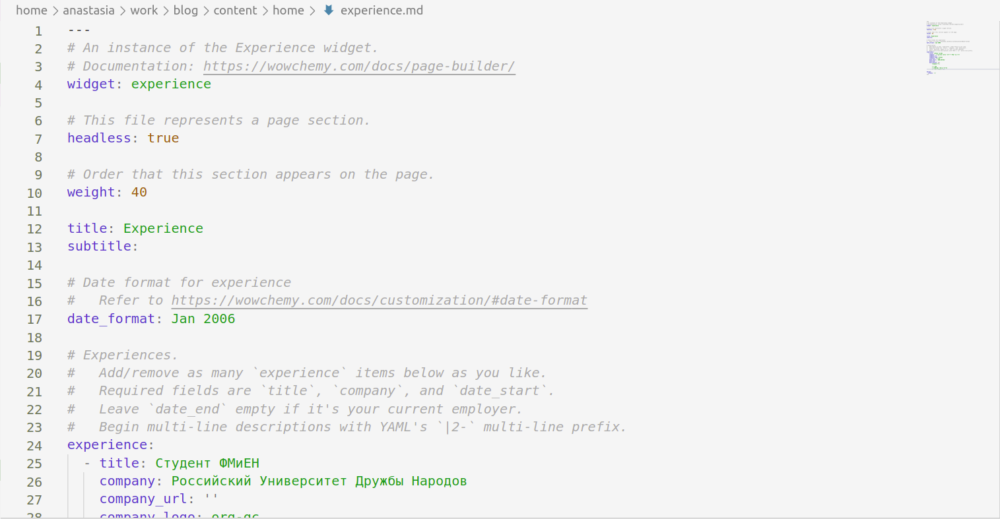
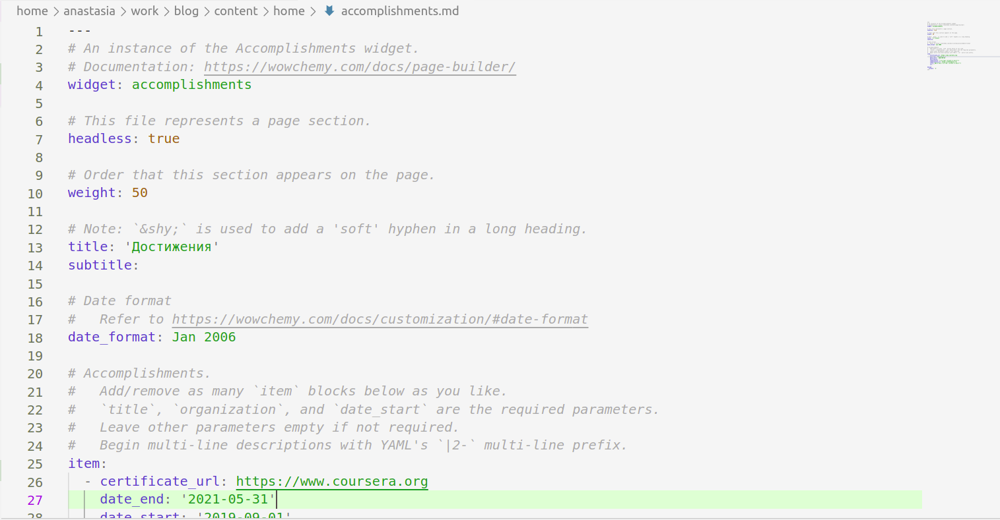
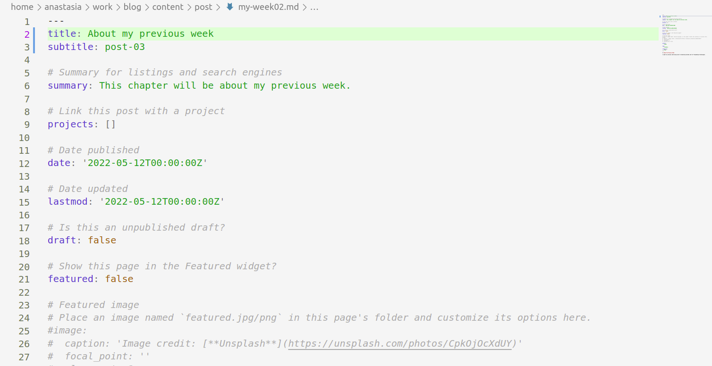
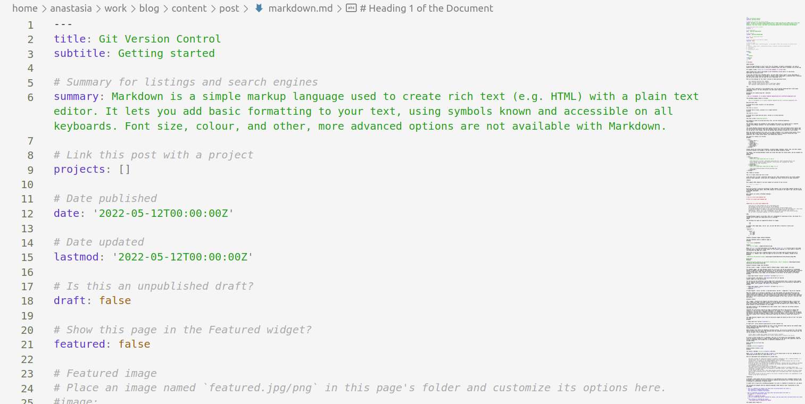
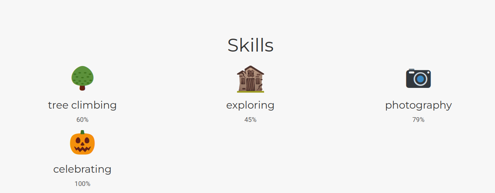
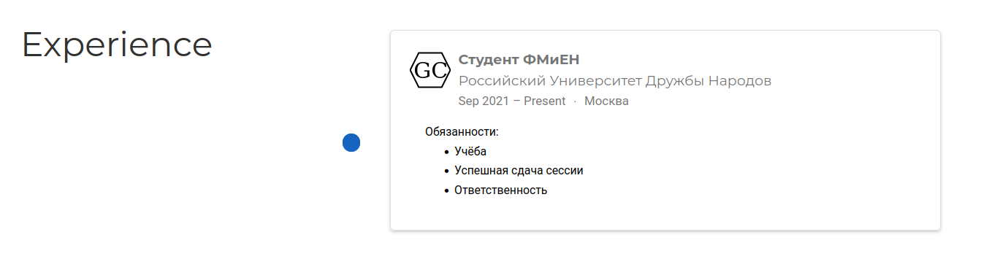
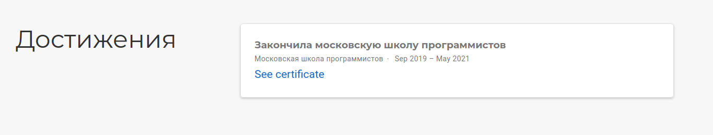
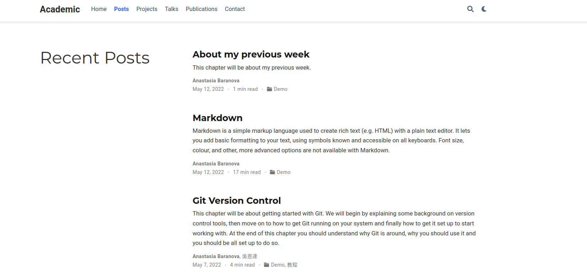

---
## Front matter
lang: ru-RU
title: Индивидуальный проект этап No 3.
author: |
    Анастасия Павловна Баранова, НБИбд-01-21\inst{1}
institute: |
	\inst{1}Российский Университет Дружбы Народов
date: 13 мая, Москва, 2022 г.

## Formatting
toc: false
slide_level: 2
theme: metropolis
header-includes: 
 - \metroset{progressbar=frametitle,sectionpage=progressbar,numbering=fraction}
 - '\makeatletter'
 - '\beamer@ignorenonframefalse'
 - '\makeatother'
aspectratio: 43
section-titles: true
---

# Добавить к сайту достижения

## Цель работы

Целью данной работы является добавление к сайту достижений, поста по прошедшей неделе и поста на тему по выбору.

# Выполнение работы

## Захожу в папку ~/work/blog/content/home

Захожу в папку ~/work/blog/content/home и по порядку изменяю файлы с необходимым мне содержанием.

## Добавляю информацию о своих навыках

Добавляю информацию о своих навыках в файле Skills.

## Добавляю информацию о своём опыте

Добавляю информацию о своём опыте в файле Experience.

## Добавляю информацию о своих достижениях

Добавляю информацию о своих достижениях в файле Accomplishments.

## Делаю пост по прошедшей неделе

Делаю пост по прошедшей неделе.

## Добавляю пост на тему по выбору

Добавляю пост на тему по выбору. Я выбрала тему *Язык разметки Markdown*.

## Загружаю всё на сайт

Загружаю всё на сайт.

## Загружаю всё на сайт

## Загружаю всё на сайт

## Загружаю всё на сайт

## Вывод

В ходе выполнения данной работы я добавила к сайту мои достижения, пост по прошедшей неделе и пост на тему по выбору (Язык разметки Markdown).