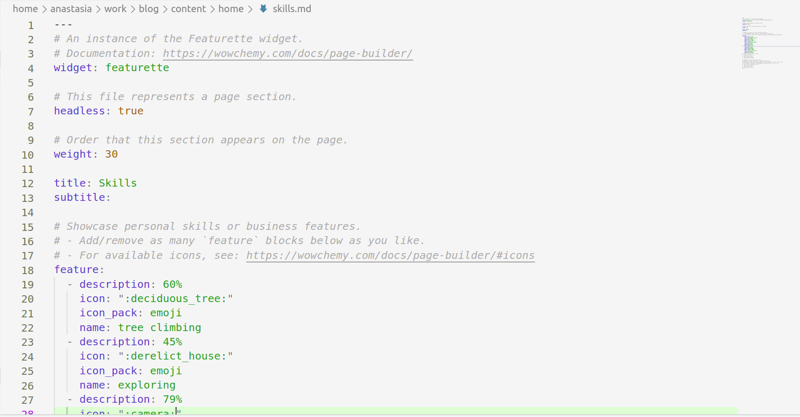
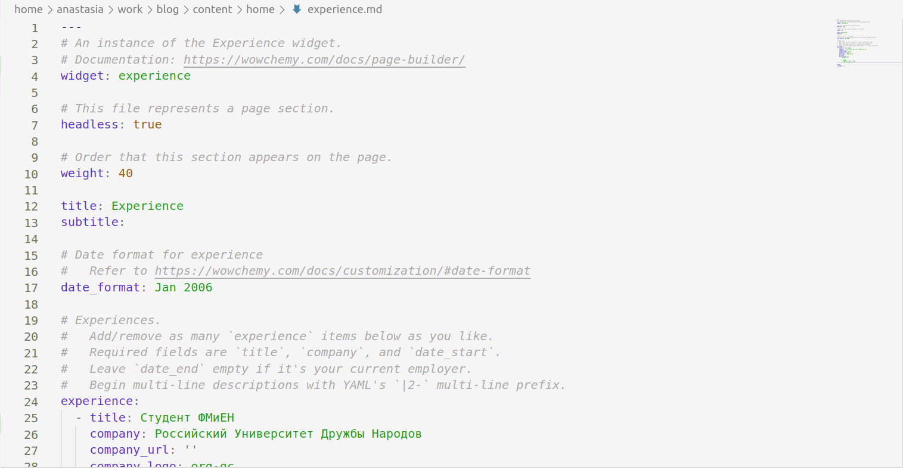
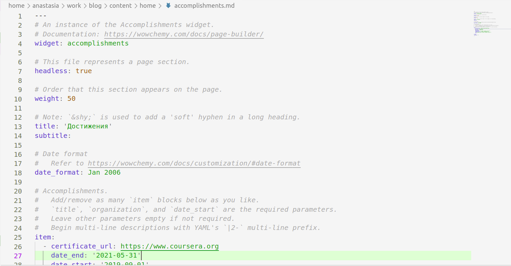
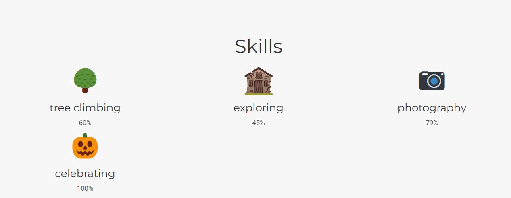
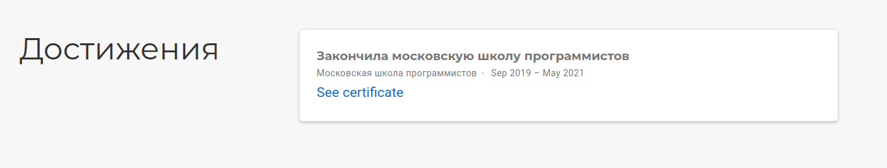

---
## Front matter
title: "ОТЧЕТ ПО ИНДИВИДУАЛЬНОМУ ПРОЕКТУ ЭТАП №3"
subtitle: "Добавление к сайту достижений"
author: "Анастасия Павловна Баранова, НБИбд-01-21"

## Generic otions
lang: ru-RU
toc-title: "Содержание"

## Bibliography
bibliography: bib/cite.bib
csl: pandoc/csl/gost-r-7-0-5-2008-numeric.csl

## Pdf output format
toc: true # Table of contents
toc-depth: 2
lof: true # List of figures
#lot: true # List of tables
fontsize: 12pt
linestretch: 1.5
papersize: a4
documentclass: scrreprt
## I18n polyglossia
polyglossia-lang:
  name: russian
  options:
	- spelling=modern
	- babelshorthands=true
polyglossia-otherlangs:
  name: english
## I18n babel
babel-lang: russian
babel-otherlangs: english
## Fonts
mainfont: PT Serif
romanfont: PT Serif
sansfont: PT Sans
monofont: PT Mono
mainfontoptions: Ligatures=TeX
romanfontoptions: Ligatures=TeX
sansfontoptions: Ligatures=TeX,Scale=MatchLowercase
monofontoptions: Scale=MatchLowercase,Scale=0.9
## Biblatex
biblatex: true
biblio-style: "gost-numeric"
biblatexoptions:
  - parentracker=true
  - backend=biber
  - hyperref=auto
  - language=auto
  - autolang=other*
  - citestyle=gost-numeric
## Pandoc-crossref LaTeX customization
figureTitle: "Рис."
#tableTitle: "Таблица"
listingTitle: "Листинг"
lofTitle: "Список иллюстраций"
#lotTitle: "Список таблиц"
lolTitle: "Листинги"
## Misc options
indent: true
header-includes:
  - \usepackage{indentfirst}
  - \usepackage{float} # keep figures where there are in the text
  - \floatplacement{figure}{H} # keep figures where there are in the text
---

# Цель работы

Целью данной работы является добавление к сайту достижений, поста по прошедшей неделе и поста на тему по выбору.

# Задание

Добавить к сайту достижения.

1. Список достижений.
    - Добавить информацию о навыках (Skills).
    - Добавить информацию об опыте (Experience).
    - Добавить информацию о достижениях (Accomplishments).
2. Сделать пост по прошедшей неделе.
3. Добавить пост на тему по выбору:
    - Легковесные языки разметки.
    - Языки разметки. LaTeX.
    - Язык разметки Markdown.

# Выполнение лабораторной работы

Захожу в папку ~/work/blog/content/home и по порядку изменяю файлы с необходимым мне содержанием. (рис. [-@fig:001])

{ #fig:001 width=70% }

Добавляю информацию о своих навыках в файле Skills. (рис. [-@fig:002])

{ #fig:002 width=70% }

Добавляю информацию о своём опыте в файле Experience. (рис. [-@fig:003])

{ #fig:003 width=70% }

Добавляю информацию о своих достижениях в файле Accomplishments. (рис. [-@fig:004])

{ #fig:004 width=70% }

Делаю пост по прошедшей неделе. (рис. [-@fig:005])

{ #fig:005 width=70% }

Добавляю пост на тему по выбору. Я выбрала тему *Язык разметки Markdown*. (рис. [-@fig:006])

{ #fig:006 width=70% }

Загружаю всё на сайт. (рис. [-@fig:007], рис. [-@fig:008], рис. [-@fig:009], рис. [-@fig:010])

{ #fig:007 width=70% }

{ #fig:008 width=70% }

{ #fig:009 width=70% }

{ #fig:010 width=70% }

# Вывод

В ходе выполнения данной работы я добавила к сайту мои достижения, пост по прошедшей неделе и пост на тему по выбору (Язык разметки Markdown).