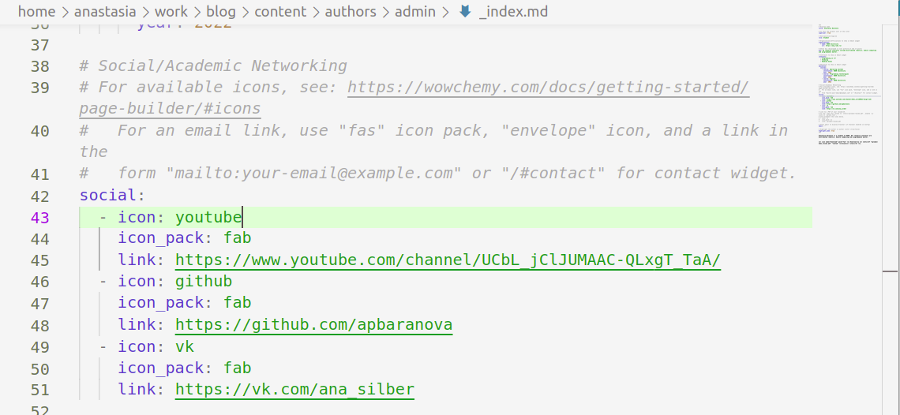
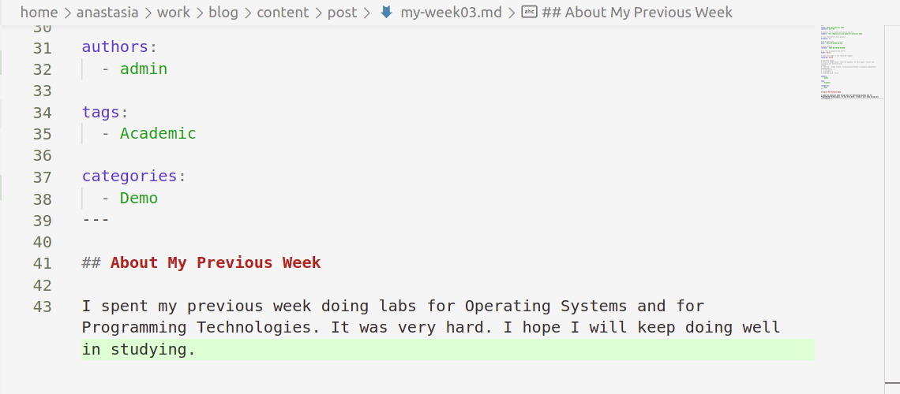
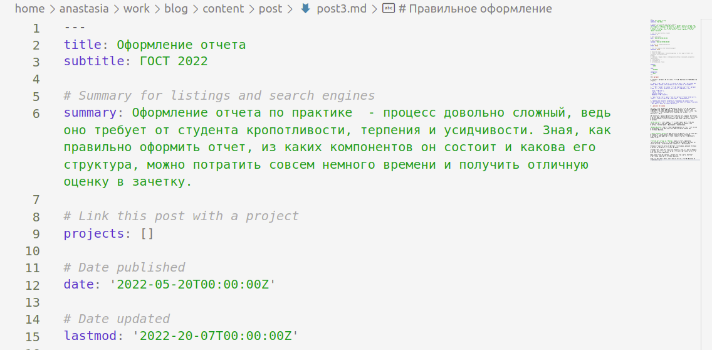
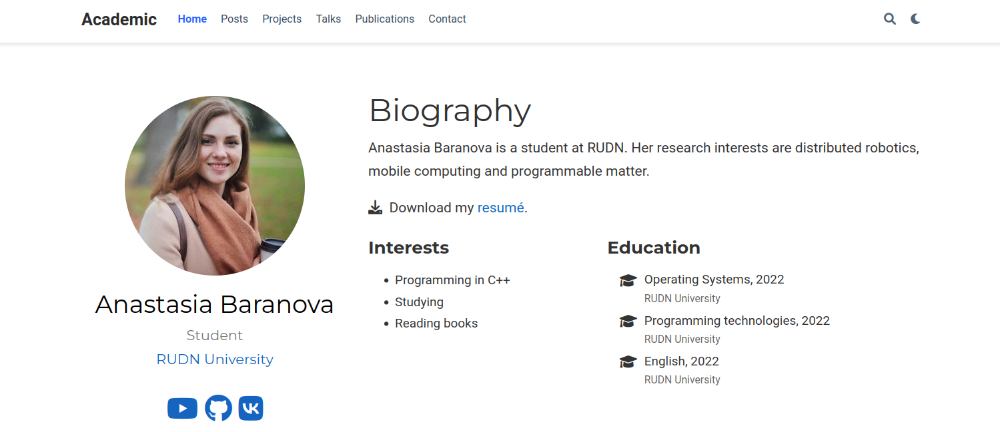
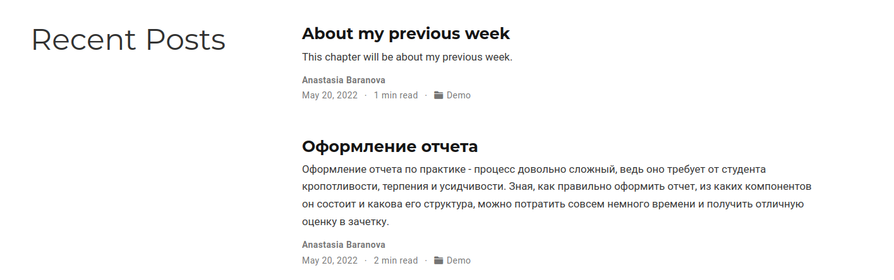

---
## Front matter
lang: ru-RU
title: Индивидуальный проект этап No 4.
author: |
    Анастасия Павловна Баранова, НБИбд-01-21\inst{1}
institute: |
	\inst{1}Российский Университет Дружбы Народов
date: 20 мая, Москва, 2022 г.

## Formatting
toc: false
slide_level: 2
theme: metropolis
header-includes: 
 - \metroset{progressbar=frametitle,sectionpage=progressbar,numbering=fraction}
 - '\makeatletter'
 - '\beamer@ignorenonframefalse'
 - '\makeatother'
aspectratio: 43
section-titles: true
---

# Цель работы

Целью данной работы является добавление к сайту ссылoк на научные и библиометрические ресурсы.

# Добавить к сайту ссылки на научные и библиометрические ресурсы.

## Цель работы

Целью данной работы является добавление к сайту ссылoк на научные и библиометрические ресурсы.

# Выполнение работы

## Добавляю ссылки на свой профиль в различных ресурсах

## Делаю пост по прошедшей неделе

## Добавляю пост на тему по выбору. Я выбрала тему *Оформление отчёта*

## Загружаю всё на сайт

## Загружаю всё на сайт

## Вывод

В ходе выполнения данной работы я добавила к сайту ссылки на научные и библиометрические ресурсы.